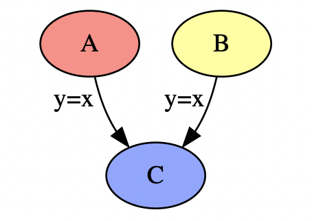
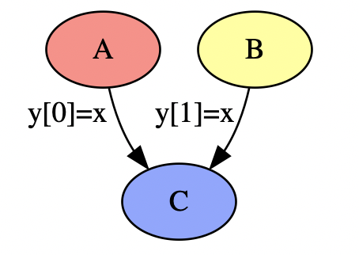
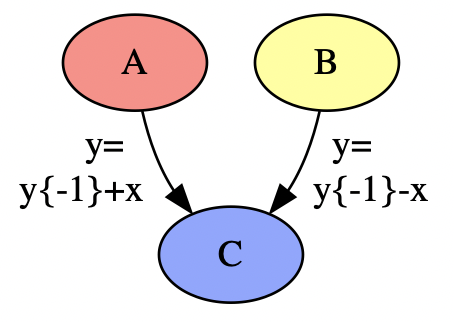
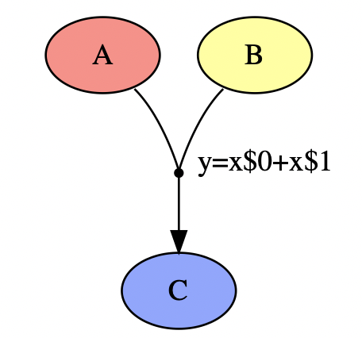

# Expression Syntax for *libmapper*

Connections between signals that are maintained by *libmapper* can be configured with
optional signal processing described in the form of an expression.

<h2 id="general-syntax">General Syntax</h2>

Expressions in libmapper must always be presented in the form `y = x`, where `x`
refers to the updated source value and `y` is the computed value to be forwarded
to the destination. Sub-expressions can be used if separated by a semicolon (`;`). Spaces may be freely used within the expression, they will have no effect on the
generated output.

## Available operators

<table style="width:100%;margin:0px;padding:0px;vertical-align:top;border:0px">
  <col style="width:10%"></col>
  <col style="width:39%"></col>
  <col style="width:2%"></col>
  <col style="width:10%"></col>
  <col style="width:39%"></col>
  <tbody>
    <tr style="border:0px">
      <th colspan="2" style="background:#555555;color:white;">Arithmetic operators</th>
      <th rowspan="14" style="border:0px;margin:0px;padding:5px"></th>
      <th colspan="2" style="background:#555555;color:white;">Bitwise operators</th>
    </tr>
    <tr>
      <td><code> + </code></td><td>addition</td>
      <td><code> << </code></td><td>left bitshift</td>
    </tr>
    <tr>
      <td><code> - </code></td><td>subtraction</td>
      <td><code> >> </code></td><td>right bitshift</td>
    </tr>
    <tr>
      <td><code> * </code></td><td>multiplication</td>
      <td><code> & </code></td><td>bitwise AND</td>
    </tr>
    <tr>
      <td><code> / </code></td><td>division</td>
      <td><code> | </code></td><td>bitwise OR</td>
    </tr>
    <tr>
      <td><code> % </code></td><td>modulo</td>
      <td><code> ^ </code></td><td>bitwise XOR (exclusive OR)</td>
    </tr>
    <tr>
      <th colspan="2" style="background:#555555;color:white">Comparison operators</th>
      <th colspan="2" style="background:#555555;color:white">Logical operators</th>
    </tr>
    <tr>
      <td><code> > </code></td><td>greater than</td>
      <td><code> ! </code></td><td>logical NOT</td>
    </tr>
    <tr>
      <td><code> >= </code></td><td>greater than or equal</td>
      <td><code> && </code></td><td>logical AND</td>
    </tr>
    <tr>
      <td><code> < </code></td><td>less than</td>
      <td><code> || </code></td><td>logical OR</td></tr>
    </tr>
    <tr>
      <td><code> <= </code></td><td>less than or equal</td>
      <th colspan="2" style="background:#555555;color:white">Conditional operator</th>
    </tr>
    <tr>
      <td><code> == </code></td><td>equal</td>
      <td rowspan=3><code> ?: </code></td><td rowspan=3>if / then / else (ternary operation) used in the form <code>a?b:c</code>. If the second operand is omitted (e.g. <code>a?:c</code>) the first operand will be used in its place.</td>
    </tr>
    <tr>
      <td><code> != </code></td><td>not equal</td>
    </tr>
    <tr style="background:none;border:0px">
      <td colspan=2 style="background:none;border:0px"></td>
    </tr>
  </tbody>
</table>

<h2 id="function-list">Function List</h2>

### Absolute value:

* `abs(x)` — absolute value

### Exponential functions:
* `exp(x)` — returns e raised to the given power
* `exp2(x)` — returns 2 raised to the given power
* `log(x)` — computes natural ( base e ) logarithm
* `log10(x)` — computes common ( base 10 ) logarithm
* `log2(x)` – computes the binary ( base 2 ) logarithm
* `logb(x)` — extracts exponent of the number

### Power functions:
* `sqrt(x)` — square root
* `cbrt(x)` — cubic root
* `hypot(x, n)` — square root of the sum of the squares of two given numbers
* `pow(x, n)` — raise a to the power b

### Trigonometric functions:
* `sin(x)` — sine
* `cos(x)` — cosine
* `tan(x)` — tangent
* `asin(x)` — arc sine
* `acos(x)` — arc cosine
* `atan(x)` — arc tangent
* `atan2(x, n)` — arc tangent, using signs to determine quadrants

### Hyperbolic functions:
* `sinh(x)` — hyperbolic sine
* `cosh(x)` — hyperbolic cosine
* `tanh(x)` — hyperbolic tangent

### Nearest integer floating point:
* `floor(x)` — nearest integer not greater than the given value
* `round(x)` — nearest integer, rounding away from zero in halfway cases
* `ceil(x)` — nearest integer not less than the given value
* `trunc(x)` — nearest integer not greater in magnitude than the given value

### Comparison functions:
* `min(x,y)` – smaller of two values (overloaded)
* `max(x,y)` – greater of two values (overloaded)
* `schmitt(x,a,b)` – a comparator with hysteresis ([Schmitt trigger](https://en.wikipedia.org/wiki/Schmitt_trigger)) with input `x`, low threshold `a` and high threshold `b`

### Random number generation:
* `uniform(x)` — uniform random distribution between 0 and the given value

### Conversion functions:
* `midiToHz(x)` — convert MIDI note value to Hz
* `hzToMidi(x)` — convert Hz value to MIDI note

### Filters
* `ema(x, w)` – a cheap low-pass filter: calculate a running *exponential moving average* with input `x` and a weight `w` applied to the current sample.

<h2 id="special-constants">Special Constants</h2>

* `pi` – the ratio of a circle's circumference to its diameter, approximately equal to 3.14159
* `e` – Euler's number or Napier's constant, approximately equal to 2.71828

<h2 id="vectors">Vectors</h2>

Individual elements of variable values can be accessed using the notation
`<variable>[<index>]` in which `index` specifies the vector element starting from zero. Overruns and underruns are not possible as the modulus will be used if the index is outside the range `<0,length-1>`. This means that negative indices may be used for indexing from the end of the vector.

When assigning values to a vector, if the source is shorter than the assignee it will be repeated as necessary, e.g. if `myvar` has length 5 and the expression assigns `myvar=[1,2,3]` its value will now be `[1,2,3,1,2]`.

Variables and expressions may also be used as indexes.

### Vector examples

* `y = x[0]` — simple vector indexing
* `y = x[1:2]` — specify a range within the vector
* `y = [x[1], x[2], x[0]]` — rearranging vector elements
* `y[1] = x` — apply update to a specific element of the output
* `y[0:2] = x` — apply update to elements `0-2` of the output vector
* `[y[0], y[2]] = x` — apply update to output vector elements `y[0]` and `y[2]` but
leave `y[1]` unchanged.
* `y = x[i]; i = i + 1;` – use the user-defined variable `i` as an index.
* `y = x[sin(x) * 5]` – use an expression to calculate an index.

### Vector reducing functions

There are several special functions that operate across all elements of the vector and output a scalar value:

* `x.any()` — output `1` if **any** of the elements of vector `x` are non-zero, otherwise output `0`
* `x.all()` — output `1` if **all** of the elements of vector `x` are non-zero, otherwise output `0`
* `x.sum()` – output the sum of the elements in vector `x`
* `x.mean()` – output the average (mean) of the elements in vector `x`
* `x.max()` – output the maximum element in vector `x`
* `x.min()` – output the minimum element in vector `x`
* `x.center()` – output the midpoint between `x.min()` and `x.max()`
* `x.norm()` – output the length of the vector `x`

### Other vector functions

* `angle(a, b)` – output the angle between vectors `a` and `b`
* `dot(a, b)` – output the dot product of vectors `a` and `b`
* `sort(x, d)` or `x.sort(d)` - output a sorted version of the vector. The output will be sorted in ascending order if `d` is positive or descending order if `d` is negative.

<h2 id="fir-and-iir-filters">FIR and IIR Filters</h2>

Past samples of expression input and output can be accessed using the notation
`<variable>{<index>}`. The index specifies the history index in samples, and must be `<=0` for the input (with `0` representing the present input sample) and `<0` for the expression output ( i.e. it cannot be a value that has not been provided or computed yet ).

Using only past samples of the expression *input* `x` we can create **Finite
Impulse Response** ( FIR ) filters - here are some simple examples:

* `y = x - x{-1}` — 2-sample derivative
* `y = x + x{-1}` — 2-sample integral

Using past samples of the expression *output* `y` we can create **Infinite
Impulse Response** ( IIR ) filters - here are some simple examples:

* `y = y{-1} * 0.9 + x * 0.1` — exponential moving average with current-sample-weight of `0.1`
* `y = y{-1} + x - 1` — leaky integrator with a constant leak of `1`

Note that `y{-n}` does not refer to the expression output, but rather to the *actual
value* of the destination signal which may have been set locally or by another map
since the last time the expression was evaluated. If you wish to reference past samples
of the expression output you will need to cache the output using a [user-defined
variable](#user-declared-variables), e.g.:

<pre style="width:50%;margin:auto">
output = output + x - 1;
y = output;
</pre>

Of course the filter can contain references to past samples of both `x` and `y` -
currently libmapper will reject expressions referring to sample delays `> 100`.

### Initializing filters

Past values of the filter output `y{-n}` can be set using additional sub-expressions, separated using semicolons:

<pre style="width:50%;margin:auto">
y = y{-1} + x;
y{-1} = 100;
</pre>

Filter initialization takes place the first time the expression evaluator is called
for a given signal instance; after this point the initialization sub-expressions will
not be evaluated. This means the filter could be initialized with the first sample of
`x` for example:

<pre style="width:50%;margin:auto">
y = y{-1} + x;
y{-1} = x * 2;
</pre>

A function could also be used for initialization, for example we could initialize `y{-1}` to a random value:

<pre style="width:50%;margin:auto">
y = y{-1} + x;
y{-1} = uniform(1000);
</pre>

Any past values that are not explicitly initialized are given the value `0`.

### Variable delays

It is possible to define a variable delay argument instead of using a constant. In this case it is necessary to add a second *maximum delay size* argument to let libmapper know how much signal memory to allocate.

<pre style="width:50%;margin:auto">
y = y{x, 100};
</pre>

### Interpolation

Using a fractional delay argument causes linear interpolation between samples:

<pre style="width:50%;margin:auto">
y = x + y{-1.5};
</pre>

<h2 id="user-defined-variables">User-Defined Variables</h2>

Up to 8 additional variables can be declared as-needed in the expression. The variable
names can be any string except for the reserved variable names `x` and `y`.  The values
of these variables are stored per-instance (if assigned from an instanced signal) or per-signal with the map context and can be accessed in
subsequent calls to the evaluator. In the following example, the user-defined variable
`ema` is used to keep track of the `exponential moving average` of the input signal
value `x`, *independent* of the output value `y` which is set to give the difference
between the current sample and the moving average:

<pre style="width:50%;margin:auto">
ema = ema{-1} * 0.9 + x * 0.1;
y = x - ema;
</pre>

Just like the output variable `y` we can initialize past values of user-defined variables before expression evaluation. **Initialization will always be performed first**, after which sub-expressions are evaluated **in the order they are written**. For example, the expression string `y=ema*2; ema=ema{-1}*0.9+x*0.1; ema{-1}=90` will be evaluated in the following order:

1. `ema{-1} = 90` — initialize the past value of variable `ema` to `90`
2. `y = ema * 2` — set output variable `y` to equal the **current** value of `ema` multiplied by `2`. The current value of `ema` is `0` since it has not yet been set.
3. `ema = ema{-1} * 0.9 + x * 0.1` — set the current value of `ema` using current value of `x` and the past value of `ema`.

User-declared variables will also be reported as map metadata, prefixed by the string `var@`. The variable `ema` from the example above would be reported as the map property `var@ema`. These metadata may be modified at runtime by editing the map property using a GUI or through the libmapper properties API:

~~~c
// C API
// establish a map between previously-declared signals 'src' and 'dst'
mpr_map map = mpr_map_new(1, &src, 1, &dst);
mpr_obj_set_prop((mpr_obj)map, MPR_PROP_EXPR, NULL, 1, MPR_STR,
                 "mix=0.1;y=y{-1}*mix+x*(1-mix);", 1);
mpr_obj_push((mpr_obj)map);

...

// modify the variable "mix"
float mix = 0.2;
mpr_obj_set_prop((mpr_obj)map, MPR_PROP_EXTRA, "var@mix", 1, MPR_FLT, &mix, 1);
mpr_obj_push((mpr_obj)map);
~~~

~~~python
# Python API
# establish a map between previously-declared signals 'src' and 'dst'
map = mpr.map(src, dst)
map['expr'] = 'mix=0.1;y=y{-1}*mix+x*(1-mix);'
map.push()

...

# modify the variable "mix"
map['var@mix'] = 0.2
map.push()
~~~

Note that modifying variables in this way is not intended for automatic (i.e. high-rate) control. If you wish to include a high-rate variable you should declare it as a signal and use convergent maps as explained below.

<h2 id="convergent-maps">Convergent maps</h2>

Convergent mapping—in which multiple source signals update a single destination signal–are supported by libmapper in five different ways:

<table style="width:100%">
  <tr>
    <th>Method</th>
    <th style="width:35%">Example</th>
  </tr>
  <tr>
    <td><strong>interleaved updates (naïve convergent maps)</strong>: if multiple source signals are connected to the same destination, new updates will simply overwrite the previous value. This is the default for singleton (i.e. non-instanced) signals.</td>
    <td>
        
    </td>
  </tr>
  <tr>
    <td><strong>partial vector updates</strong>: if the destination signal has a vector value (i.e. a value with a length > 1), individual sources may address different elements of the destination.</td>
    <td>
        
    </td>
  </tr>
    <tr>
    <td><strong>shared instance pools</strong>: instanced destination signals will automatically assign different instances to different sources.</td>
    <td>
        
    </td>
  </tr>
    <tr>
    <td><strong>destination value references</strong>: including the destination signal value in the expression enables simple "mixing" of multiple sources in an IIR filter. Within the mapping expression, <code>y{-N}</code> represents the Nth past value of the <strong>destination signal</strong> (rather than the expression output) and will thus reflect updates to this signal caused by other maps or local control. If you wish to use past samples of the expression output instead you will need to cache this output explicitly as explained above in the section <a href="#fir-and-iir-filters">FIR and IIR Filters</a>.</td>
    <td>
        
    </td>
  </tr>
  </tr>
    <tr>
    <td><strong>convergent maps</strong>: arbitrary combining functions can be defined by creating a single map with multiple sources. Libmapper will automatically reorder the sources alphabetically by name, and source values are referred to in the map expression by the string <code>x$</code>+<code>&lt;source index&gt;</code> as shown in the example to the right. When editing the expression it is crucial to use the correct signal indices which may have been reordered from the array provided to the map constructor; they can be retrieved using the function <code>mpr_map_get_sig_idx()</code> or you can use mpr_map_new_from_str() to have libmapper handle signal index lookup automatically. when a map is selected in the <a href="https://github.com/libmapper/webmapper">Webmapper</a> UI the individual sources are labeled with their index.</td>
    <td>
        
    </td>
  </tr>
</table>

<h3 id="instance-management">Instance Management</h3>

Signal instancing can also be managed from within the map expression by manipulating a special variable named `alive` that represents the instance state. The use cases for in-map instancing can be complex, but here are some simple examples:

<table>
    <tr>
        <th></th>
        <th>Singleton Destination</th>
        <th>Instanced Destination</th>
    </tr>
    <tr>
        <th>Singleton Source</th>
        <td>conditional output</td>
        <td>conditional serial instancing</td>
    </tr>
    <tr>
        <th>Instanced Source</th>
        <td>conditional output</td>
        <td>modified instancing</td>
    </tr>
</table>

#### Conditional output

In the case of a map with a singleton (non-instanced) destination, in-map
instance management can be used for conditional updates. For example,
imagine we want to map `x -> y` but only propagate updates when `x > 10` – we could use the expression:

<pre style="width:50%;margin:auto">
alive = x > 10;
y = x;
</pre>

Since in this case the destination signal is not instanced it will not be "released" when `alive` evaluates to False, however any assignments to the output `y` while `alive` is False will not take effect. The statement `alive = x > 10` is evaluated first, and the update `y = x` is only propagated to the destination if `x > 10` evaluates to True (non-zero) **at the time of assignment**. The entire expression is evaluated however, so counters can be incremented etc. even while `alive` is False. There is a more complex example in the section below on [Variable Timetags](#timetags).

#### Conditional serial instancing

When mapping a singleton source signal to an instanced destination signal there are several possible desired behaviours:

1. The source signal controls **one** of the available destination signal instances. The destination instance is activated upon receiving the first update and a release event is triggered when the map is destroyed so the lifetime of the map controls the lifetime of the destination signal instance. This configuration is the default for maps from singleton->instanced signals, and is achieved by setting the map property `use_inst` to True.
2. The source signal controls **all** of the available **active** destination signal instances **in parallel**. This is accomplished by setting the `use_inst` property of the map to False (0). Note that in this case a source update will not activate new instances, so this configuration should probably only be used with destination signals that manage their own instances or that are persistent (non-ephemeral).
    * Example 1: a destination signal named *polyPressure* belongs to a software shim device for interfacing with MIDI. The singleton signal *mouse/position/x* is mapped to *polyPressure*, and the map's `use_inst` property is set to False to enable controlling the poly pressure parameter of all active notes in parallel.
3. The source signal controls available destination signal instances **serially**. This is accomplished by manipulating the `alive` variable as described above. On each rising edge (transition from 0 to non-zero) of the `alive` variable a new instance id map will be generated

#### Modified instancing

*currently undocumented*

<h2 id="propagation-management">Propagation Management</h2>

By default, convergent maps will trigger expression evaluation when *any* of the source signals are updated. For example, the convergent map `y=x$0+x$1` will output a new value whenever `x$0` *or* `x$1` are updated. Evaluation can be disabled for a source signal by inserting an underscore `_` symbol before the source name, e.g. `y=x$0+_x$1` will be evaluated only when the source `x$0` is updated, while updates to source `x$1` will be stored but will not trigger evaluation or propagation to the destination signal.

If desired, the entire expression can be evaluated "silently" so that updates do not propagate to the destination. This is accomplished by manipulating a special variable named `muted`. For maps with singleton destination signals this has an identical effect to manipulating the `alive` variable, but for instanced destinations it enables filtering updates without releasing the associated instance.

The example below implements a "change" filter in which only updates with different input values are sent to the destination:

<pre style="width:50%;margin:auto">
muted = (x == x{-1});
y = x;
</pre>

Note that (as above) the value of the `muted` variable must be true (non-zero) **when y is assigned** in order to mute the update; the arbitrary example below will instead mute the next update following the condition `(x==x{-1})`:

<pre style="width:50%;margin:auto">
y = x;
muted = (x == x{-1});
</pre>

<h2 id="timetags">Timetags</h2>

The precise time at which a signal or variable is updated is always tracked by libmapper and communicated with the data value. In the future we plan to use this information in the background for discarding out-of-order packets and jitter mitigation, but it may also be useful in your expressions.

The timetag associated with a variable can be accessed using the syntax `t_<variable_name>` – for example the time associated with the current sample of signal `x` is `t_x`, and the timetag associated with the last update of a hypothetical user-defined variable `foo` would be `t_foo`. This syntax can be used anywhere in your expressions:

* `y = t_x` — output the timetag of the input instead of its value
* `y = t_x - t_x{-1}` — output the time interval between subsequent updates

This functionality can be used along with in-map signal instancing to limit the output rate. The following example only outputs if more than 0.5 seconds has elapsed since the last output, otherwise discarding the input sample.

<pre style="width:50%;margin:auto">
alive = (t_x - t_y{-1}) > 0.5;
y = x;
</pre>

Also we can calculate a moving average of the sample period:

<pre style="width:50%;margin:auto">
y = y{-1} * 0.9 + (t_x - t_y{-1}) * 0.1;
</pre>

Of course the first value for `(t_x-t_y{-1})` will be very large since the first value for `t_y{-1}` will be `0`. We can easily fix this by initializing the first value for `t_y{-1}` – remember from above that this part of the expression will only be called once so it will not adversely affect the efficiency of out expression:

<pre style="width:50%;margin:auto">
t_y{-1} = t_x;
y = y{-1} * 0.9 + (t_x - t_y{-1}) * 0.1;
</pre>

Here's a more complex example with 4 sub-expressions in which the rate is limited but incoming samples are averaged instead of discarding them:

<pre style="width:50%;margin:auto">
alive = (t_x - t_y{-1}) > 0.1;
y = B / C;
B = !alive * B + x;
C = alive ? 1 : C + 1;
</pre>

Explanation:

order | step           | expression clause         | description
----- | -------------- | ------------------------- | -----------
1 | check elapsed time | <code>alive = (tx - ty{-1}) > 0.1</code> | Set `alive` to `1` (true) if more than `0.1` seconds have elapsed since the last output; or `0` otherwise.
2 | conditional output | `y = B / C`               | Output the average `B/C` (if `alive` is true)
3 | update accumulator | `B = !alive * B + x`      | reset accumulator `B` to 0 if `alive` is true, add `x`
4 | update count       | `C = alive ? 1 : C + 1`   | increment `C`, reset if `alive` is true

<h2 id="instances">Instances</h2>

Input and output signals addressed by libmapper may be *instanced* meaning that there a multiple independent instances of the object or phenomenon represented by the signal. For example, a signal representing `/touch/position` on a multitouch display would have an instance corresponding to each active touch. This means that a signal value `x` can have up to four dimensions:

dimension        | syntax  | application
-----------------|---------|-------------
vector elements  | `x[n]`  | representation of signals that are naturally multidimensional, e.g. 3D position
input signals    | `x$n`   | [convergent maps](#convergent-maps)
signal history   | `x{-n}` | DSP (e.g. smoothing filters); [live looping](https://nime.pubpub.org/pub/2pqbusk7/release/1)
signal instances | TBA     | representation of signals that are [naturally multiplex and/or ephemeral](https://ieeexplore.ieee.org/document/8259406), e.g. multitouch

As mentioned in the section on vectors above, the index `n` can be a literal, a variable, or an expression. In the case of expression-type input signal indices parentheses must be used to indicate the scope of the index, e.g. `y=x$(sin(x)>0);`.

<h2 id="reduce-functions">Reducing functions</h2>

There are several special functions that operate across all elements of a signal dimension. Use the table below and simply replace `<dim>` with the dimension name: *instance*, *history*, *signal*, or *vector*. 

* `x.<dim>.any()` – output `1` if any element of `x` is non-zero, otherwise output `0` (for each vector element)
* `x.<dim>.all()` – output `1` if all elements of `x` are non-zero, otherwise output `0` (for each vector element)
* `x.<dim>.count()` — output the number of elements of `x`, e.g. `x.instance.count()` to get the number of active instances.
* `x.<dim>.sum()` – output the sum of the values of all elements of `x`
* `x.<dim>.mean()` – output the mean of the values of all elements of `x`
* `x.<dim>.max()` – output the maximum value of all elements of `x`
* `x.<dim>.min()` – output the minimum value of all elements of `x`
* `x.<dim>.size()` – output the difference between the maximum and minimum values of all elements, i.e. `x.<dim>.max()-x.<dim>.min()`
* `x.<dim>.center()` – output the N-dimensional point located at the center of the element ranges, i.e. `(x.<dim>.max()+x.<dim>.min())*0.5`

Note that the `history` type of reduce function requires an integer argument after `.history` specifying the number of samples to reduce, e.g. `x.history(5).mean()`. The `instance` dimension reduce functions operate over all *currently active* instances of the signal.

These functions accept subexpressions as arguments. For example, we can calculate the linear displacement of input `x` averaged across all of its active instances with the expression `y=(x-x{-1}).instance.mean()`. Similarly, we can calculate the average angular displacement around the center of a bounding box including all active instances:

<pre style="width:50%;margin:auto">
c0{-1}=x.instance.center();
c1=x.instance.center();
y=(angle(x{-1}-c0, x-c1)).instance.mean();
c0=c1
</pre>

In a scenario where `x` represents the touch coordinates on a multitouch surface, this value gives mean rotation of all touches around their mutual center.

<h3 id="reduce">Reduce() with arrow expressions</h3>

In addition to the specialised reducing functions mentioned above, map expression can also include the function `reduce()` with a user-defined arrow function that operates over any of the four signal dimensions:

dimension        | syntax
-----------------|---------------------------
vector elements  | x.vector.reduce(a, b *[= initialValue]* -> ...)
input signals    | x.signal.reduce(a, b *[= initialValue]* -> ...)
signal instances | x.instance.reduce(a, b *[= initialValue]* -> ...)
signal history   | x.history(*len*).reduce(a, b *[= initialValue]* -> ...)

Note that the `history` type of reduce function requires an integer argument after `.history` specifying the number of samples to reduce. The `reduce()` function requires arguments specifying the `input` and `accumulator` variable names, followed by the arrow symbol `->` and an expression describing how to process each element. The `input` and `accumulator` variable names are user-defined, and have only local scope, i.e. if reduce functions are nested using the same variable names no variable collisions will occur. The `accumulator` variable can be initialised is needed; otherwise it will default to zero.

For example, the following expression will calculate the mean signal value over the last 10 samples:

<pre style="width:50%;margin:auto">
y = x.history(10).reduce(a, b -> a + b) / 10;
</pre>

Note: this expression could also be implemented as:

<pre style="width:50%;margin:auto">
y = x.history(10).mean();
</pre>

As mentioned above, reduce functions can be nested to reduce across multiple dimensions within a single expression. Obviously the nested reduce functions must operate across *different* dimensions in order for the expression to work. The expression below calculates the sum of all vector elements of all input signals:

<pre style="margin:auto">
y = x.signal.reduce(a, b -> a.vector.reduce(c, d -> c + d) + b);
</pre>
