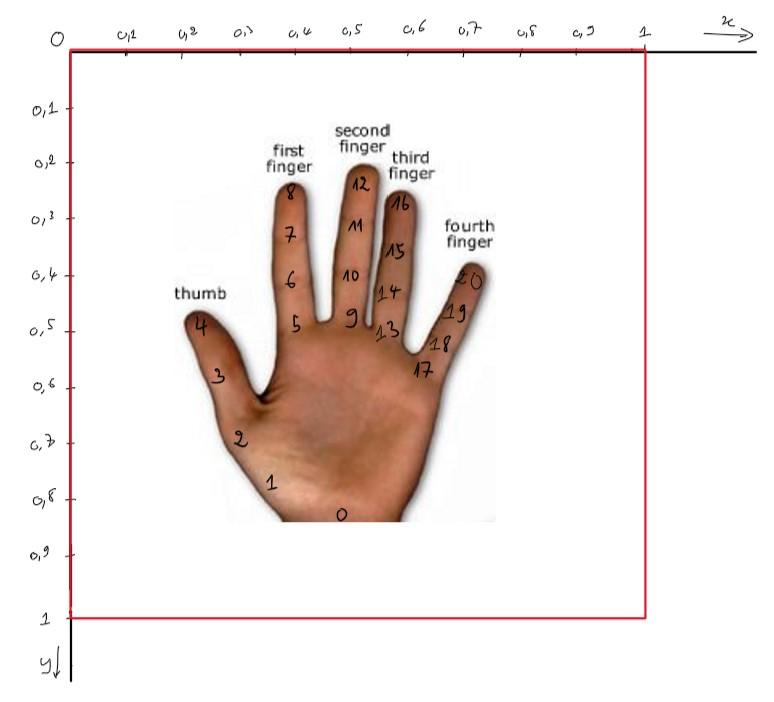

# Mediapipe + libmapper

[Mediapipe](https://mediapipe.dev/) is an open-source project that is maintained by a team of engineers at Google research. Mediapipe offers several pre-built solutions for creating applications that implement real-time machine learning models for perceptual tasks. Some of mediapipe's solutions include:

- Hand Tracking
- Face Mesh
- Pose Detection
- 3D Object Detection
  
And many more! You can find a complete list of mediapipe solutions [here](https://google.github.io/mediapipe/solutions/solutions).

In this tutorial, you will create a simple libmapper network that establishes a connection between the **Mediapipe Hands** solution (acting as a producer of data) and another libmapper enabled process (acting as a consumer of data).

_Note: This tutorial is confirmed to work on unix-based systems only, but other operating systems may also be supported._

## Data Producer

This section will provide a walk through for creating a *libmapper* device that exposes the hand-tracking landmarks as estimated by the mediapipe model. This process will be created using the `mediapipe` package from PyPi ([link](https://pypi.org/project/mediapipe/)). To install this package, run the following command:

```bash
pip install mediapipe
```

### Mediapipe sample project

The mediapipe team has a well defined python project that utilizes their package. The source code for that project after removing the unnecessary code for static images is as follows:

```python
import cv2
import mediapipe as mp
mp_drawing = mp.solutions.drawing_utils
mp_hands = mp.solutions.hands

# For webcam input:
cap = cv2.VideoCapture(0)

with mp_hands.Hands(
    min_detection_confidence=0.5,
    min_tracking_confidence=0.5) as hands:
  
  # Hand-tracking loop
  while cap.isOpened():
    success, image = cap.read()
    if not success:
      continue

    image = cv2.cvtColor(cv2.flip(image, 1), cv2.COLOR_BGR2RGB)
    image.flags.writeable = False
    results = hands.process(image)

    # Draw the hand annotations on the image.
    image.flags.writeable = True
    image = cv2.cvtColor(image, cv2.COLOR_RGB2BGR)
    if results.multi_hand_landmarks:
      for hand_landmarks in results.multi_hand_landmarks:

          # ----------------------------------------
          # ESTIMATED HAND LANDMARKS ACCESSIBLE HERE
          # ----------------------------------------

        mp_drawing.draw_landmarks(
            image, hand_landmarks, mp_hands.HAND_CONNECTIONS)

    cv2.imshow('MediaPipe Hands', image)
    if cv2.waitKey(5) & 0xFF == 27:
      break
cap.release()
```

### Setup libmapper device and signal

Next, we will set up a libmapper device and associated signals.

```python
import libmapper as mpr

# libmapper producer device
dev = mpr.Device("hand_tracker")

# add a libmapper signal to device defined above. This signal will
# be transmitting a vector with len=2 to efficiently send x & y
# position data.
index_tip = dev.add_signal(mpr.Direction.OUTGOING, "index_tip",
                           2, mpr.Type.FLOAT)
```

### Poll device and update signal

The next step is to poll the libmapper device in **the main video loop** and update the signal with the estimated values produced by mediapipe. These steps are as follows:

```python
# Non-blocking poll, as we will use the framerate from the hand-tracking logic.
dev.poll()

# Set signal value to the x & y coordinates of the index_tip landmark. Refer to diagram below for all landmark indices.
index_tip.set_value([hand_landmarks.landmark[8].x,
                     hand_landmarks.landmark[8].y])
```

#### Mediapipe Landmarks

The landmarks for each estimated joint is shown in the following figure.



### Final Source Code

The code for this producer device example is stored in the file `hand_tracking.py`. The entire source code is as follows:

```python
#!/usr/bin/python3
import cv2
import mediapipe as mp
import libmapper as mpr
import math

mp_drawing = mp.solutions.drawing_utils
mp_hands = mp.solutions.hands

dev = mpr.Device("hand_tracker")

index_tip = dev.add_signal(mpr.Direction.OUTGOING, "index_tip",
                           2, mpr.Type.FLOAT, None, None, None)

# Begin webcam input for hand tracking:
hands = mp_hands.Hands(min_detection_confidence=0.7,
                       min_tracking_confidence=0.5)

cap = cv2.VideoCapture(0)

while cap.isOpened():
    success, image = cap.read()
    if not success:
        break

    # Poll the libmapper producer device to ensure that the signals are being updated properly
    dev.poll()

    image = cv2.cvtColor(cv2.flip(image, 1), cv2.COLOR_BGR2RGB)
    image.flags.writeable = False
    results = hands.process(image)

    # Draw the hand annotations on the image.
    image.flags.writeable = True
    image = cv2.cvtColor(image, cv2.COLOR_RGB2BGR)

    if results.multi_hand_landmarks:
        # Update the libmapper devices with landmark data
        for hand_landmarks in results.multi_hand_landmarks:

            # ----------------------------------------
            # ESTIMATED HAND LANDMARKS ACCESSIBLE HERE
            # ----------------------------------------

            index_tip.set_value([hand_landmarks.landmark[8].x,
                             hand_landmarks.landmark[8].y])


            # Draw skeletal structure over video
            mp_drawing.draw_landmarks(
                image, hand_landmarks, mp_hands.HAND_CONNECTIONS)

    cv2.imshow('MediaPipe Hands', image)

    if cv2.waitKey(5) & 0xFF == 27:
        break

hands.close()
cap.release()
```

### Run the Producer Script

To run this program, issue the following command:

```bash
python3 hand_tracker.py
```

If successful, you should see a screen with a video capture from your web-camera.

To ensure that the libmapper device is created properly, you can use one of the libmapper session managers to view the device. Issuing the following [umapper](https://github.com/malloch/umapper) command:

```bash
./umapper -a
```

Should result in and output of:

```bash
Devices:
    hand_tracker.1
        output signals:
            index_tip
```

#### Producer Demo Video

Here is a quick video demonstrating this process.

<https://user-images.githubusercontent.com/15327742/124003597-85a9cf00-d9ad-11eb-8fb8-ebc2c6ec6edd.mp4>

## Data Consumer

We will create a **very** minimal data consumer python script called `consumer.py`. The source code for this script is as follows:

```python
#!/usr/bin/python3
import libmapper as mpr

# This handler function will simply print the value of the signal it is associated with
def handler(s, e, i, v, t):
    print(v)

# Initialize a libmapper device
dev = mpr.Device("consumer")


# Initialize a libmapper signal
sig = dev.add_signal(mpr.Direction.INCOMING, "input_signal", 1,
                     mpr.Type.FLOAT, None, None, None, None, handler)

# Poll the Consumer device forever
while True:
    dev.poll(100)
```

### Run the Consumer Script

To run this script, issue the command:

```bash
python3 consumer.py
```

To ensure that the libmapper device is created properly, you can use one of the libmapper session managers to view the device. Issuing the following command:

```bash
./umapper -a
```

Should result in and output of:

```bash
Devices:
    consumer.1
        input signals:
            input_signal 
```

## Creating a Map

Now that we have created both a data producer as well as a data consumer, we can create a libmapper mapping between them to transfer data across a network.

### Ensure Devices are Running

First run both of the python scripts in separate processes. Next, ensure that both devices are running properly by issuing the command:

```bash
./umapper -a
```

from the umapper directory. This should produce the output:

```bash
Devices:
    hand_tracker.1
        output signals:
            index_tip 
    consumer.1
        input signals:
            input_signal 
```

which shows that both devices are active, and that there is one input signal and one output signal.

### Establish a Map

To establish a map between the two signals, issue the following umapper command:

```bash
./umapper -M hand_tracker.1/index_tip consumer.1/input_signal
```

When you run `./umapper -a` again, you should see the following output:

```bash
Devices:
    hand_tracker.1
        output signals:
            index_tip 
                Maps:
                     hand_tracker.1/index_tip -> consumer.1/input_signal, 
    consumer.1
        input signals:
            input_signal
```

which reflects a successful mapping.

#### Creating Map Demo Video

Here is a quick video demonstrating this process.

<https://user-images.githubusercontent.com/15327742/124005133-1cc35680-d9af-11eb-9c24-836d10147e2c.mp4>

## Convergent Map Example

Now that we have seen a simple example of 1:1 mapping from mediapipe to another libmapper device, we can explore using convergent maps and libmapper expressions to set up more sophisticated examples.

### Update Python Script

In order to use convergent maps, we need to have more than one signal setup in our producer script. In this case, we will set up a new signal that represents the `(x,y)` position of the thumb tip. Update the `hand_tracker.py` file with the following:

```python
... # in the setup section

thumb_tip = dev.add_signal(mpr.Direction.OUTGOING, "thumb_tip",
                           2, mpr.Type.FLOAT)


... # in the main loop

# Thumb landmark index given by diagram found earlier in this tutorial
index_tip.set_value([hand_landmarks.landmark[4].x,
                     hand_landmarks.landmark[4].y])

...
```

While this will work for a single hand, to use the PONG example effectively we need to track two hands with mediapipe. This can be achieved using the multi-handed tracker provided by mediapipe hands. The full code to accomplish this is as follows:

```python
#!/usr/bin/python3

import cv2
import mediapipe as mp
import libmapper as mpr
mp_drawing = mp.solutions.drawing_utils
mp_hands = mp.solutions.hands


hand_dev = mpr.Device("hand_tracker")

one_index = hand_dev.add_signal(mpr.Direction.OUTGOING, "one_index",
                                2, mpr.Type.FLOAT)
one_thumb = hand_dev.add_signal(mpr.Direction.OUTGOING, "one_thumb",
                                2, mpr.Type.FLOAT)
two_index = hand_dev.add_signal(mpr.Direction.OUTGOING, "two_index",
                                2, mpr.Type.FLOAT)
two_thumb = hand_dev.add_signal(mpr.Direction.OUTGOING, "two_thumb",
                                2, mpr.Type.FLOAT)

# Begin webcam input for hand tracking:
hands = mp_hands.Hands(min_detection_confidence=0.8,
                       min_tracking_confidence=0.5)

cap = cv2.VideoCapture(0)

width = cap.get(cv2.CAP_PROP_FRAME_WIDTH)
height = cap.get(cv2.CAP_PROP_FRAME_HEIGHT)

while cap.isOpened():
    success, image = cap.read()
    if not success:
        break

    # Poll the mediapipe devices to ensure that the signals are being updated properly
    hand_dev.poll()

    # Flip the image horizontally for a later selfie-view display, and convert
    # the BGR image to RGB.
    image = cv2.cvtColor(cv2.flip(image, 1), cv2.COLOR_BGR2RGB)

    # To improve performance, optionally mark the image as not writeable to
    # pass by reference.
    image.flags.writeable = False
    results = hands.process(image)

    # Draw the hand annotations on the image.
    image.flags.writeable = True
    image = cv2.cvtColor(image, cv2.COLOR_RGB2BGR)

    if results.multi_hand_landmarks:
        if (len(results.multi_hand_landmarks) == 2):
            for hand in results.multi_hand_landmarks:
        
                # ----------------------------------------
                # ESTIMATED HAND LANDMARKS ACCESSIBLE HERE
                # ----------------------------------------

                if (results.multi_handedness[results.multi_hand_landmarks.index(hand)].classification[0].label == "Left"):
                    one_index.set_value([hand.landmark[8].x,
                                         hand.landmark[8].y])
                    one_thumb.set_value([hand.landmark[4].x,
                                         hand.landmark[4].y])
                    
                    mp_drawing.draw_landmarks(
                    image, hand, mp_hands.HAND_CONNECTIONS,
                    mp_drawing.DrawingSpec(color=(92, 49, 29), thickness=2, circle_radius=4),
                    mp_drawing.DrawingSpec(color=(201, 107, 62), thickness=2, circle_radius=2))
                else:
                    two_index.set_value([hand.landmark[8].x, hand.landmark[8].y])
                    two_thumb.set_value([hand.landmark[4].x, hand.landmark[4].y])
                    
                    mp_drawing.draw_landmarks(
                    image, hand, mp_hands.HAND_CONNECTIONS,
                    mp_drawing.DrawingSpec(color=(105, 39, 94), thickness=2, circle_radius=4),
                    mp_drawing.DrawingSpec(color=(217, 54, 190), thickness=2, circle_radius=2))
                
    cv2.imshow('MediaPipe Hands', image)

    if cv2.waitKey(5) & 0xFF == 27:
        break

hands.close()
cap.release()
```

### Run the Updated Producer Script

To run the script, issue the same command as before:

```bash
python3 hand_tracking.py
```

If successful, you should be able to see two signals attached to the hand-tracking device using umapper. Issuing the following command:

```bash
./umapper -a
```

should result in and output of:

```bash
Devices:
    hand_tracker.1
        output signals:
            one_index 
            one_thumb 
            two_index 
            two_thumb
```

### Godot Pong

For this convergent map example, a more sophisticated consumer device will be created to use on the libmapper network. An interesting example is using a version of the popular PONG game as a consumer that can be controlled via a mapping to another libmapper device. Example code for this can be found in the [pong](https://github.com/lemurph/IOMapper/tree/main/godot_examples/pong) directory of [IOmapper](https://github.com/lemurph/IOMapper) (a libmapper binding for the godot game engine) examples folder.

#### IOmapper & Godot Script

You first need to **build IOmapper** by following the instructions found [here](https://github.com/lemurph/IOMapper/blob/main/README.md). Once you have successfully built IOmapper with Godot, you can open the PONG example project from above.

The code required to create a libmapper device in godot is in `pong.gd` and is as follows:

```GDscript
extends Node2D

onready var height = get_viewport_rect().size.y
var dev = IOMapper.new()

# Change this to increase it to more units/second

# Called when the node enters the scene tree for the first time.
func _ready():
 dev.init("pong")
 dev.add_sig(IOMapper.INCOMING, "player1_y", 1, IOMapper.FLOAT)
 dev.add_sig(IOMapper.INCOMING, "player2_y", 1, IOMapper.FLOAT)
 dev.set_value_float("player1_y", 1)
 dev.set_value_float("player2_y", 1)

# Called every frame. 'delta' is the elapsed time since the previous frame.
func _process(delta):
 dev.poll()
 var p1_y = dev.get_value_float("player1_y")
 var p2_y = dev.get_value_float("player2_y")
 
 
 $Left.position.y = p1_y * height
 $Right.position.y = p2_y * height
```

A quick scan of the code shows that there is one libmapper device with two input signals that are responsible for the Y-pos of each player paddle in the PONG game.

The godot scene should be similar to the following image:


### Running Godot Pong

The result of `./umapper -a` while the godot scene (as well as the mediapipe script) is running is again as follows:

```bash
Devices:
    hand_tracker.1
        output signals:
            one_index 
            one_thumb 
            two_index 
            two_thumb 
    pong.1
        input signals:
            player1_y 
            player2_y 
```

### Convergent Mapping with libmapper Expression

In order to create a convergent map (where two or more source signals are mapped to a single destination signal) we must define an expression. This expression is responsible for computing the value that travels "across the map".

#### Pinch to Move

Using the libmapper expression:

```
pinch = (x0-x1).norm();
y = (pinch <= 0.1) ? (x0[1] + x1[1]) / 2 : y{-1};
```

We are able to define a map that sets the `y-value` to be equal to the average y position of both the index-tip and thumb-tip **only** if the *"pinch strength"* exceeds a certain value, otherwise the `y-value` is set to the most recent measurement (effectively leaving it in its current position).

### Creating a Convergent Map

Once again, using umapper, we define a convergent map by issuing the following command (including the expression defined above):

```bash
./umapper -M hand_tracker.1/one_index hand_tracker.1/one_thumb pong.1/player1_y @expr "pinch=(x0-x1).norm();y=(pinch<=0.1)?(x0[1]+x1[1])/2:y{-1};"
```

Establish a mirrored mapping for the player two signals by issuing the command:

```bash
./umapper -M hand_tracker.1/two_index hand_tracker.1/two_thumb pong.1/player2_y @expr "pinch=(x0-x1).norm();y=(pinch<=0.1)?(x0[1]+x1[1])/2:y{-1};"
```

Which after running `./umapper -a` again should result in the following:

```bash
Devices:
    hand_tracker.1
        output signals:
            one_thumb 
                Maps:
                     [hand_tracker.1/one_thumb, hand_tracker.1/one_index] -> pong.1/player1_y, 
            one_index 
                Maps:
                     [hand_tracker.1/one_thumb, hand_tracker.1/one_index] -> pong.1/player1_y, 
            two_thumb 
                Maps:
                     [hand_tracker.1/two_thumb, hand_tracker.1/two_index] -> pong.1/player2_y, 
            two_index 
                Maps:
                     [hand_tracker.1/two_thumb, hand_tracker.1/two_index] -> pong.1/player2_y, 
    pong.1
        input signals:
            player1_y 
            player2_y 
```

#### Pong with Convergent Maps Demo

Here is a quick video demonstrating the Pong example with convergent maps in libmapper:

https://user-images.githubusercontent.com/15327742/124510292-dd7b7800-dda9-11eb-81c3-4ec629e3a537.mp4


## Other Mediapipe Integrations

While this tutorial focused specifically on the **Mediapipe: Hands** solution, the same principles can be applied to create libmapper devices that integrate with other Mediapipe projects. Set up signals to transmit data and use the `set_value()` function to extract landmarks to send across the network.

We look forward to seeing what other interesting use-cases are implemented with the help of libmapper!
