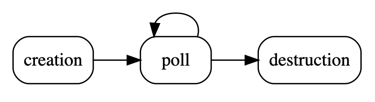

# Getting started with libmapper and C++

## Overview of the C++ API

If you take a look at the [API documentation](../html/index.html), there is
a section called "modules".  This is divided into the following sections:

* [Graphs](../html/classmapper_1_1Graph.html)
* [Devices](../html/classmapper_1_1Device.html)
* [Signals](../html/classmapper_1_1Signal.html)
* [Maps](../html/classmapper_1_1Map.html)
* [Lists](../html/classmapper_1_1List.html)

For this tutorial, the only sections to pay attention to are **Devices** and **Signals**. **Graphs**, and **Maps** are mostly used when building
user interfaces for designing mapping configurations.

## Devices

### Creating a device

To create a _libmapper_ device, it is necessary to provide a `name` to the
constructor, which is overloaded to accept arguments of either
`const char*` or C++ `std::string`:

~~~c++
mapper::Device dev(const char *name, mapper.Graph graph = 0);
mapper::Device dev(std::string name, mapper.Graph graph = 0);
~~~

In regular usage only the first argument is needed. The optional `Graph`
argument can be used to specify different networking parameters, such as
specifying the name of the network interface to use.

An example of creating a device:

~~~c++
mapper::Device dev("test");
~~~

### Polling the device

The device lifecycle looks like this:

In other words, after a device is created, it must be continuously polled during
its lifetime.

The polling is necessary for several reasons: to respond to requests on the
admin bus; to check for incoming signals; to update outgoing signals.  Therefore
even a device that does not have signals must be polled.  The user program must
organize to have a timer or idle handler which can poll the device often enough.
The polling interval is not extremely sensitive, but should be 100 ms or less.
The faster it is polled, the faster it can handle incoming and outgoing signals.

The `poll()` function can be blocking or non-blocking, depending on how you want
your application to behave.  It takes an optional number of milliseconds during
which it should do some work before returning:

~~~c++
int dev.poll(int block_ms);
~~~

An example of calling it with non-blocking behaviour:

~~~c++
dev.poll();
~~~

If your polling is in the middle of a processing function or in response to a
GUI event for example, non-blocking behaviour is desired.  On the other hand if
you put it in the middle of a loop which reads incoming data at intervals or
steps through a simulation for example, you can use `poll()` as your "sleep"
function, so that it will react to network activity while waiting.

It returns the number of messages handled, so optionally you could continue to
call it until there are no more messages waiting.  Of course, you should be
careful doing that without limiting the time it will loop for, since if the
incoming stream is fast enough you might never get anything else done!

Note that an important difference between blocking and non-blocking polling is
that during the blocking period, messages will be handled immediately as they
are received.  On the other hand, if you use your own sleep, messages will be
queued up until you can call poll(); stated differently, it will
"time-quantize" the message handling. This is not necessarily bad, but you
should be aware of this effect.

Since there is a delay before the device is completely initialized, it is
sometimes useful to be able to determine this using `ready()`.  Only when
`dev.ready()` returns non-zero is it valid to use the device's name.

## Signals

Now that we know how to create a device, poll it, and free it, we only need to
know how to add signals in order to give our program some input/output
functionality.  While libmapper enables arbitrary connections between _any_
declared signals, we still find it helpful to distinguish between two type of
signals: `inputs` and `outputs`. 

- `outputs` signals are _sources_ of data, updated locally by their parent
  device
- `inputs` signals are _consumers_ of data and are **not** generally updated
  locally by their parent device.

This can become a bit confusing, since the "reverb" parameter of a sound
synthesizer might be updated locally through user interaction with a GUI,
however the normal use of this signal is as a _destination_ for control data
streams so it should be defined as an `input` signal.  Note that this
distinction is to help with GUI organization and user-understanding –
_libmapper_ enables connections from input signals and to output signals if
desired.

### Creating a signal

We'll start with creating a "sender", so we will first talk about how to update
output signals.  A signal requires a bit more information than a device, much of
which is optional:

1. the direction of the signal: either `Direction::INCOMING` or `Direction::OUTGOING`
* a name for the signal (must be unique within a devices inputs or outputs)
* the signal's vector length
* the signal's data type, one of `Type::INT32`, `Type::FLOAT`, or `Type::DOUBLE`
* the signal's unit (optional)
* the signal's minimum value (optional, type and length should match previous args)
* the signal's maximum value (optional, type and length should match previous args)
* the signal's instance count (pass `NULL` for singleton signals)

examples:

~~~c++
using namespace mapper;
Signal input;
input = dev.add_sig(Direction::INCOMING, "my_input", 1, Type::FLOAT,
                    "m/s").set_callback(h, Signal::Event::UPDATE);

int min[4] = {1,2,3,4};
int max[4] = {10,11,12,13};
Signal output;
output = dev.add_sig(Direction::OUTGOING, "my_output", 4, Type::INT32, 0, min, max);
~~~

The only _required_ parameters here are the signal "direction" (IN or OUT),
"length", its name, and data type.  Signals are assumed to be vectors of values,
so for usual single-valued signals, a length of 1 should be specified.  Finally,
supported types are currently `Type::INT32`, `Type::FLOAT`, or `Type::DOUBLE`,
for `int`, `float`, or `double` values, respectively.

The other parameters are not strictly required, but the more information you
provide, the more _libmapper_ can do some things automatically.  For example, if
`minimum` and `maximum` are provided, it will be possible to create
linear-scaled connections very quickly.  If `unit` is provided, _libmapper_ will
be able to similarly figure out a linear scaling based on unit conversion (from
centimeters to inches for example). Currently automatic unit-based scaling is
not a supported feature, but will be added in the future.  You can take
advantage of this future development by simply providing unit information
whenever it is available.  It is also helpful documentation for users.

Notice that optional values are provided as `void*` pointers.  This is because a
signal can either be `int`, `float` or `double`, and your maximum and minimum
values should correspond in type.  So you should pass in a `int*`, `float*` or
`double*` by taking the address of a local variable.

Lastly, it is usually necessary to be informed when input signal values change.
This is done by providing a function to be called whenever its value is modified
by an incoming message.  It is passed in the `handler` parameter.

An example of creating a "barebones" `int` scalar output signal with no unit,
minimum, or maximum information:

~~~c++
mapper::Signal sig;
sig = dev.add_signal(mapper::Direction::OUTGOING, "outA", 1, mapper::Type::INT32);
~~~

An example of a `float` signal where some more information is provided:

~~~c++
float min = 0.0f;
float max = 5.0f;
mapper::Signal sig;
sig = dev.add_signal(mapper::Direction::OUTGOING, "sensor1", 1,
                     mapper::Type::FLOAT, "V", &min, &max);
~~~

So far we know how to create a device and to specify an output signal
for it.  To recap, let's review the code so far:

~~~c++
mapper::Device dev("test_sender");
mapper::Signal sig;
float min = 0.0f;
float max = 5.0f;
sig = dev.add_signal(mapper::Direction::OUTGOING, "sensor1", 1,
                     mapper::Type::FLOAT, "V", &min, &max);
    
while (!done) {
    dev.poll(10);
    ... do stuff ...
    ... update signals ...
}
~~~

It is possible to retrieve a device's signals at a later time using the function
`dev.signals()`. This function returns an object of type
`mapper::List<mapper::Signal>` which can be used to retrieve all of the signals
belonging to a particular device:

~~~c++
std::cout << "Signals belonging to " << dev[Property::NAME] << std::endl;

mapper::List<mapper::Signal> list = dev.signals(mapper::Direction::INCOMING).begin();
for (; list != list.end(); ++list) {
    std::cout << "signal: " << *list << std::endl;
}

// or more simply:
for (mapper::Signal sig : dev.signals())
    std::cout << "signal: " << sig << std::endl;
~~~

### Updating signals

We can imagine the above program getting sensor information in a loop.  It could
be running on an network-enable ARM device and reading the ADC register
directly, or it could be running on a computer and reading data from an Arduino
over a USB serial port, or it could just be a mouse-controlled GUI slider.
However it's getting the data, it must provide it to _libmapper_ so that it will
be sent to other devices if that signal is mapped.

This is accomplished by the function `set_value()`, which is overloaded to
accept a wide variety of argument types (scalars, std::vector, std::array, etc.).
Check the API documentation for more information. The data passed to set_value()
is not required to match the length and type of the signal itself—libmapper will
perform type coercion if necessary. More than one 'sample' of signal update may be
applied at once by e.g. updating a signal with length 5 using a 20-element
array.

So in the "sensor 1" example, assuming in `do_stuff()` we have some code which
reads sensor 1's value into a float variable called `v1`, the loop becomes:

~~~c++
while (!done) {
    dev.poll(50);
    
    // call a hypothetical user function that reads a sensor
    float v1 = do_stuff();
    sig.set_value(v1);
}
~~~

This is about all that is needed to expose sensor 1's value to the network as a
mappable parameter.  The _libmapper_ GUI can now map this value to a receiver,
where it could control a synthesizer parameter or change the brightness of an
LED, or whatever else you want to do.

### Signal conditioning

Most synthesizers of course will not know what to do with the value of sensor1
--it is an electrical property that has nothing to do with sound or music.  This
is where _libmapper_ really becomes useful.

Scaling or other signal conditioning can be taken care of _before_ exposing the
signal, or it can be performed as part of the mapping.  Since the end user can
demand any mathematical operation be performed on the signal, he can perform
whatever mappings between signals as he wishes.

As a developer, it is therefore your job to provide information that will be
useful to the end user.

For example, if sensor 1 is a position sensor, instead of publishing "voltage",
you could convert it to centimeters or meters based on the known dimensions of
the sensor, and publish a "/sensor1/position" signal instead, providing the unit
information as well.

We call such signals "semantic", because they provide information with more
meaning than a relatively uninformative value based on the electrical properties
of the sensing technqiue.  Some sensors can benefit from low-pass filtering or
other measures to reduce noise.  Some sensors may need to be combined in order
to derive physical meaning.  What you choose to expose as outputs of your device
is entirely application-dependent.

You can even publish both "/sensor1/position" and "/sensor1/voltage" if desired,
in order to expose both processed and raw data.  Keep in mind that these will
not take up significant processing time, and _zero_ network bandwidth, if they
are not mapped.

### Receiving signals

Now that we know how to create a sender, it would be useful to also know how to
receive signals, so that we can create a sender-receiver pair to test out the
provided mapping functionality. The current value and timestamp for a signal can
be retrieved at any time by calling the function `value()` on your signal
object, however for event-driven applications you may want to be informed of new
values as they are received or generated.

As mentioned above, the `add_signal()` function takes an optional `handler`
argument.  This is a function that will be called whenever the value of that
signal changes.  To create a receiver for a synthesizer parameter "pulse width"
(given as a ratio between 0 and 1), specify a handler when calling `add_signal()`.
We'll imagine there is some C++ synthesizer implemented as a class `Synthesizer`
which has functions `setPulseWidth()` which sets the pulse width in a thread-safe
manner, and `startAudioInBackground()` which sets up the audio thread.

Create the handler function, which is fairly simple as it has been overloaded to
accept different scalar datatypes and other functionality. The full version of
the handler is:

~~~c++
void handler(mapper::Signal signal, mapper::Signal::Event event,
             mapper::Id instance, int length, mapper::Type type,
             const void *value, mapper::Time time)
{
    ...
}
~~~

Please refer to the API documentation for more detail on acceptable handler
definitions.  For our example we will use a simpler handler since we know our
signal type is scalar float:

~~~c++
void pulsewidth_handler(mapper::Signal signal, float value, mapper::Time time)
{
    Synthesizer *synth = (Synthesizer*)(void*)signal["synthptr"];
    synth->setPulseWidth(value);
}
~~~

First, the pointer to the `Synthesizer` instance is extracted from the stored
`synthptr` property, then it is dereferenced to set the pulse width according to
the value pointed to by `value`.

Then `main()` will look like,

~~~c++
void main()
{
    Synthesizer synth;
    synth.startAudioInBackground();
    
    float min_pw = 0.0f;
    float max_pw = 1.0f;
    
    mapper::Device dev("synth");
    
    mapper::Signal pulsewidth =
        dev.add_signal(mapper::Direction::INCOMING, "pulsewidth", 1,
                       mapper::Type::FLOAT, 0, &min_pw, &max_pw)
           .set_property("synthptr", &synth)
           .set_callback(pulsewidth_handler);
    
    while (!done)
        dev.poll(50);
}
~~~

## Working with timetags

_libmapper_ uses the `Time` class to store
[NTP timestamps](http://en.wikipedia.org/wiki/Network_Time_Protocol#NTP_timestamps).
For example, the handler function called when a signal update is received
contains a `time` argument.  This argument indicates the time at which the
source signal was _sampled_ (in the case of sensor signals) or _generated_ (in
the case of sequenced or algorithimically-generated signals).

_libmapper_ provides helper functions for getting the current device-time,
setting the value of a `Time` instance from other representations, and comparing or
copying timetags.  Check the API documentation for more information.

## Working with signal instances

_libmapper_ also provides support for signals with multiple _instances_, for
example:

* control parameters for polyphonic synthesizers;
* touches tracked by a multitouch surface;
* "blobs" identified by computer vision systems;
* objects on a tabletop tangible user interface;
* _temporal_ objects such as gestures or trajectories.

The important qualities of signal instances in _libmapper_ are:

* **instances are interchangeable**: if there are semantics attached to a
  specific instance it should be represented with separate signals instead.
* **instances can be ephemeral**: signal instances can be dynamically created
  and destroyed. _libmapper_ will ensure that linked devices share a common
  understanding of the relatonships between instances when they are mapped.
* **map once for all instances**: one mapping connection serves to map all of a
  signal's instances.

All signals possess one instance by default. If you would like to reserve more
instances you can use:

~~~c++
sig.reserve_instances(int num)
sig.reserve_instances(int num, mapper::Id *ids)
sig.reserve_instances(int num, mapper::Id *ids, void **data)
~~~

After reserving instances you can update a specific instance, for example:

~~~c++
Signal::Instance si = sig.instance(id);
si.set_value(value);

// or simply:
sig.instance(id).set_value(value);
~~~

The `instance` argument is of type `mapper::Id` does not have to be considered as
an array index - it can be any 64-bit vbalue that is convenient for labelling your
instance. _libmapper_ will internally create a map from your id label to one of the
preallocated instance structures.

### Receiving instances

You might have noticed earlier that the full handler function called when a signal
update is received has a argument called `instance`. Here is the function
prototype again:

~~~c++
void handler(mapper::Signal signal, mapper::Signal::Event event,
             mapper::Id instance, int len, mapper::Type type,
             const void *value, mapper::Type time);
~~~

For convenience the handler is also available in a form with the signal instance
pre-fetched:

~~~c++
void handler(mapper::Signal::Instance sigInst, mapper::Signal::Event event,
             int len, mapper::Type type, const void *value, mapper::Type time);
~~~

Under normal usage, the `instance` argument in the first handler example will have
a value (0 <= n <= num_instances) and can be used as an array index. Remember that
you will need to reserve instances for your input signal when calling
`Device::add_signal()` or using `sig.reserve_instances()` if you want to receive instance updates.

### Instance Stealing

For handling cases in which the sender signal has more instances than the
receiver signal, the _instance allocation mode_ can be set for an input signal
to set an action to take in case all allocated instances are in use and a
previously unseen instance id is received. Use the function:

~~~c++
sig.set_property(mapper::Property::STEAL_MODE, mapper::Map::Stealing type);
~~~

The argument `mode` can have one of the following values:

* `Stealing::NONE` Default value, in which no stealing of instances will occur;
* `Stealing::OLDEST` Release the oldest active instance and reallocate its
  resources to the new instance;
* `Stealing::NEWEST` Release the newest active instance and reallocate its
  resources to the new instance;

If you want to use another method for determining which active instance to
release (e.g. the sound with the lowest volume), you can create a `handler` for
the signal and write the method yourself:

~~~c++
void my_handler(mapper::Signal signal, mapper::Signal::Event event,
                mapper::Id instance, int len, mapper::Type type, const void *val,
                mapper::Time time)
{
    if (event == mapper::Signal::Event::OFLW) {
        // user code chooses which instance to release
        mapper::Id release_me = choose_instance_to_release(sig);

        sig.instance(release_me).release();
        return;
    }
}
~~~

For this function to be called when instance stealing is necessary, we need to
register it for `Signal::Event::OFLW` events:

~~~c++
sig.set_callback(my_handler, Signal::Event::UPDATE | Signal::Event::OFLW);
~~~

## Publishing metadata

Things like device names, signal units, and ranges, are examples of metadata
--information about the data you are exposing on the network.

_libmapper_ also provides the ability to specify arbitrary extra metadata in the
form of name-value pairs.  These are not interpreted by _libmapper_ in any way,
but can be retrieved over the network.  This can be used for instance to give a
device X and Y information, or to perhaps give a signal some property like
"reliability", or some category like "light", "motor", "shaker", etc.

Some GUI could then use this information to display information about the
network in an intelligent manner.

Any time there may be extra knowledge about a signal or device, it is a good
idea to represent it by adding such properties, which can be of any
OSC-compatible type.  (So, numbers and strings, etc.)

The property can be set using the functions below, using either a name (C string
or std::string) or a value from the `Property` enum if available. The getter and
setter functions are also overloaded with the subscript operator.

~~~c++
void <object>.set_property(<name>, <value>);
void <object>.set_property(Property, <value>);

// or
<object>[<name>] = <value>;
<object>[Property] = <value>;
~~~

The `<value>` arguments can be a scalar, array or std::vector of type `int`,
`float`, `double`, `char*`, or `void*`.

For example, to store a `float` indicating the X position of a device, you can
call it like this:

~~~c++
dev.set_property("x", 12.5f);
sig.set_property("sensingMethod", "resistive");
~~~

Retrieving a property is also quite simple, returning a PropVal object that can be
cast to the appropriate type.

~~~c++
<type> var = obj.property(<name>);
<type> var = obj.property(Property);

// or
<type> var = obj[<name>];
<type> var = obj[Property];
~~~

### Reserved keys

You can use any property name not already reserved by _libmapper_.

#### Reserved keys for all objects

`data`, `id`, `is_local`, `lib_version`, `version`

#### Additional reserved keys for devices

`linked`, `name`, `num_maps_in`, `num_maps_out`, `num_sigs_in`, `num_sigs_out`,
`ordinal`, `status`, `synced`

#### Additional reserved keys for signals

`device`, `direction`, `jitter`, `length`, `max`, `maximum`, `min`, `minimum`,
`name`, `num_inst`, `num_maps_in`, `num_maps_out`, `period`, `steal`, `type`,
`unit`, `use_inst`

#### Additional reserved keys for maps

`expr`, `muted`, `num_sigs_in`, `process_loc`, `protocol`, `scope`, `status`,
`use_inst`
