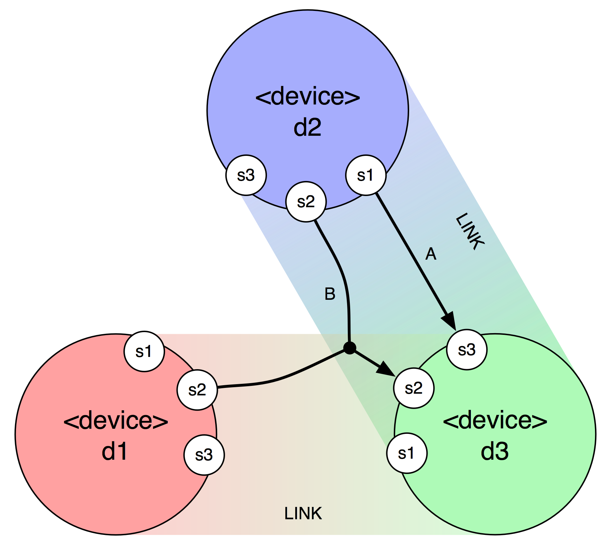

Introduction
============

These tutorials introduce new users to _libmapper_, providing steps to construct software programs that are compatible with the _libmapper_ network.  A program typically implements a libmapper **device**, and declares **signals**, which can be inputs or outputs. After this, run-time **maps** can be easily created and configured between declared signals. libmapper takes care of announcing and discovering available resources on the network, creating and maintaining connections between entities, and various other functions.

The diagram above shows a simplified network of libmapper-enabled devices. In real use, devices and signals are expected to be given short descriptive names rather than the identifiers used in this example.

* A **signal** is a producer or consumer of real-time data. Signals in libmapper
must have a `name`, `datatype`, and `vector length`. Signals must belong to a **device**.
* A **device** is a logical collections of signals along with some associated
metadata. In the diagram there are three devices labelled `d1`, `d2`, and `d3`
* A **link** refers to a runtime network connection between two communicating devices.
The diagram shows two active links: `d1 <-> d3` and `d2 <-> d3`.
* A **map** refers to a directional association formed between two or more **signals**,
causing streaming data to be transformed and transported across the network.
The diagram shows two active maps: `d2:s1 -> d3:s3` (labelled `A`) and the more complex
*convergent* map `[d1:s2, d2:s2] -> d3:s2` (labelled `B`).

Often, a device will possess only outputs (e.g. a program that gets information from a human input device like a joystick), or only inputs (e.g. a software-controlled synthesizer).  For convenience, in these tutorials we will call devices with outputs "controllers", or "senders", and devices with inputs "synthesizers", or "receivers".  This betrays the use case that was in mind when the _libmapper_ system was conceived, but of course receivers could just as well be programs that control motors, lights, or anything else that might need control information.  Similarly, senders could easily be programs that generate trajectory data based on algorithmic composition, or whatever you can imagine.

It is also possible to create devices which have inputs and outputs, and these can be mapped "in between" senders and receivers in order to perform some intermediate processing for example.  However, this is a more advanced topic that won't be covered in this tutorial.

Essentially, each device only needs to do a few things:

1. **start a libmapper "device"**
2. **add some signals**
3. **update any outputs periodically**
4. **poll the device to process incoming messages**

Detailed tutorials are provided for using libmapper in the following programming languages and environments:

  * [C](./tutorial_c.html)
  * [C++](./tutorial_cpp.html)
  * [Python](./tutorial_python.html)
  * [Java](./tutorial_java.html)
  * [Max/MSP](./tutorial_maxmsp_multiobj.html)
  * [Puredata](./tutorial_pure_data.html)
  
