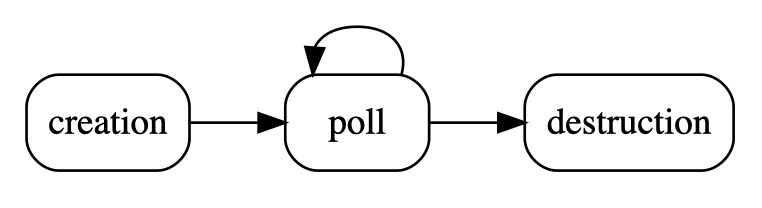

# Getting started with libmapper and Python

Since _libmapper_ uses GNU autoconf, getting started with the library is the
same as any other library on Linux; use `./configure` and then `make` to compile
it.  You'll need `swig` available if you want to compile the Python bindings.
On Mac OS X, we provide a precompiled Framework bundle for 32- and 64-bit Intel
platforms, so using it with XCode should be a matter of including it in your
project.

Once you have libmapper installed, it can be imported into your program:

~~~python
import mapper
~~~

## Overview of the API organization

The libmapper API is is divided into the following sections:

* Graph
* Devices
* Signals
* Maps

For this tutorial, the only sections to pay attention to are **Devices** and
**Signals**. **Graphs** and **Maps** are mostly used when building
user interfaces for designing mapping configurations.

## Devices

### Creating a device

To create a _libmapper_ device, it is necessary to provide a device name to the
constructor.  There is an initialization period after a device is created where
a unique ordinal is chosen to append to the device name.  This allows multiple
devices with the same name to exist on the network.

A second optional parameter of the constructor is a Graph object.  It is not
necessary to provide this, but can be used to specify different networking
parameters, such as specifying the name of the network interface to use.

An example of creating a device:

~~~python
dev = mapper.device("my_device")
~~~

## Polling the device

The device lifecycle looks like this:

In other words, after a device is created, it must be continuously polled during
its lifetime.

The polling is necessary for several reasons: to respond to requests on the
admin bus; to check for incoming signals; to update outgoing signals.  Therefore
even a device that does not have signals must be polled.  The user program must
organize to have a timer or idle handler which can poll the device often enough.
The polling interval is not extremely sensitive, but should be 100 ms or less.
The more often it is polled, the faster it can handle incoming signals.

The `poll` function can be blocking or non-blocking, depending on how you want
your application to behave.  It takes a number of milliseconds during which it
should do some work, or 0 if it should check for any immediate actions and then
return without waiting:

~~~python
dev.poll(block_ms)
~~~

An example of calling it with non-blocking behaviour:

~~~python
dev.poll(0)
~~~

If your polling is in the middle of a processing function or in response to a
GUI event for example, non-blocking behaviour is desired.  On the other hand if
you put it in the middle of a loop which reads incoming data at intervals or
steps through a simulation for example, you can use `poll()` as your "sleep"
function, so that it will react to network activity while waiting.

It returns the number of messages handled, so optionally you could continue to
call it until there are no more messages waiting.  Of course, you should be
careful doing that without limiting the time it will loop for, since if the
incoming stream is fast enough you might never get anything else done!

Note that an important difference between blocking and non-blocking polling is
that during the blocking period, messages will be handled immediately as they
are received.  On the other hand, if you use your own sleep, messages will be
queued up until you can call `poll()`; stated differently, it will
"time-quantize" the message handling.  This is not necessarily bad, but you
should be aware of this effect.

Since there is a delay before the device is completely initialized, it is
sometimes useful to be able to determine this using `ready()`.  Only when
`ready()` returns non-zero is it valid to use the device's name.

## Signals

Now that we know how to create a device and poll it, we only need to know how to
add signals in order to give our program some input/output functionality.  While
libmapper enables arbitrary connections between _any_ declared signals, we still
find it helpful to distinguish between two type of signals: `inputs` and
`outputs`. 

- `outputs` signals are _sources_ of data, updated locally by their parent
device
- `inputs` signals are _consumers_ of data and are **not** generally
updated locally by their parent device.

This can become a bit confusing, since the "reverb" parameter of a sound
synthesizer might be updated locally through user interaction with a GUI,
however the normal use of this signal is as a _destination_ for control data
streams so it should be defined as an `input` signal.  Note that this distinction
is to help with GUI organization and user-understanding – _libmapper_ enables
connections from input signals and to output signals if desired.

### Creating a signal

We'll start with creating a "sender", so we will first talk about how to update
output signals.  A signal requires a bit more information than a device, much of
which is optional:

* a name for the signal (must be unique within a devices inputs or outputs)
* the signal's vector length
* the signal's data type: `mapper.INT32`, `mapper.FLT`, `mapper.DBL`
* the signal's unit (optional)
* the signal's minimum value (optional)
* the signal's maximum value (optional)

for input signals there is an additional argument:

* a function to be called when the signal is updated

examples:

~~~python
sig_in = dev.add_signal(mapper.DIR_IN, "my_input", 1, mpr.FLT, "m/s", -10, 10, h)

sig_out = dev.add_signal(mapper.DIR_OUT, "my_output", 4, mpr.INT32, None, 0, 1000)
~~~

The only _required_ parameters here are the signal "length", its name, and data
type.  Signals are assumed to be vectors of values, so for usual single-valued
signals, a length of 1 should be specified.  Finally, supported types are
currently 'i' or 'f' for `int` or `float` values, respectively.

The other parameters are not strictly required, but the more information you
provide, the more _libmapper_ can do some things automatically.  For example, if
`minimum` and `maximum` are provided, it will be possible to create
linear-scaled connections very quickly.  If `unit` is provided, _libmapper_ will
be able to similarly figure out a linear scaling based on unit conversion
(centimeters to inches for example).  Currently automatic unit-based scaling is
not a supported feature, but will be added in the future.  You can take
advantage of this future development by simply providing unit information
whenever it is available.  It is also helpful documentation for users.

Lastly, it is usually necessary to be informed when input signal values change.
This is done by providing a function to be called whenever its value is modified
by an incoming message.  It is passed in the `handler` parameter.

An example of creating a "barebones" `int` scalar output signal with no unit,
minimum, or maximum information:

~~~python
outA = dev.add_signal(mapper.DIR_OUT, "outA", 1, mapper.INT32, None, None, None)
~~~

or omitting some arguments:

~~~python
outA = dev.add_signal(mapper.DIR_OUT, "outA", 1, mapper.INT32)
~~~

An example of a `float` signal where some more information is provided:

~~~python
sensor1 = dev.add_signal(mpr.DIR_OUT, "sensor1", 1, mpr.FLT, "V", 0.0, 5.0)
~~~

So far we know how to create a device and to specify an output signal for it.
To recap, let's review the code so far:

~~~python
import mapper as mpr

dev = mapper.device("test_sender")
sensor1 = dev.add_signal(mpr.DIR_OUT, "sensor1", 1, mpr.FLT, "V", 0.0, 5.0)
    
while 1:
    dev.poll(50)
    ... do stuff ...
    ... update signals ...
~~~

It is possible to retrieve a device's inputs or outputs by name or by index at a
later time using the functions `get_signal_by_<name/index>`.

### Updating signals

We can imagine the above program getting sensor information in a loop.  It could
be running on an network-enabled ARM device and reading the ADC register
directly, or it could be running on a computer and reading data from an Arduino
over a USB serial port, or it could just be a mouse-controlled GUI slider.
However it's getting the data, it must provide it to _libmapper_ so that it will
be sent to other devices if that signal is mapped.

This is accomplished by the `set_value` function:

~~~python
<sig>.set_value(value)
~~~

So in the "sensor 1 voltage" example, assuming in `do_stuff()` we have some code
which reads sensor 1's value into a float variable called `v1`, the loop
becomes:

~~~python
while 1:
    dev.poll(50)
    v1 = do_stuff()
    sensor1.set_value(v1)
~~~

This is about all that is needed to expose sensor 1's voltage to the network as
a mappable parameter.  The _libmapper_ GUI can now be used to create a mapping
between this value and a receiver, where it could control a synthesizer
parameter or change the brightness of an LED, or whatever else you want to do.

### Signal conditioning

Most synthesizers of course will not know what to do with "voltage"--it is an
electrical property that has nothing to do with sound or music.  This is where
_libmapper_ really becomes useful.

Scaling or other signal conditioning can be taken care of _before_ exposing the
signal, or it can be performed as part of the mapping.  Since the end user can
demand any mathematical operation be performed on the signal, he can perform
whatever mappings between signals as he wishes.

As a developer, it is therefore your job to provide information that will be
useful to the end user.

For example, if sensor 1 is a position sensor, instead of publishing "voltage",
you could convert it to centimeters or meters based on the known dimensions of
the sensor, and publish a "sensor1/position" signal instead, providing the unit
information as well.

We call such signals "semantic", because they provide information with more
meaning than a relatively uninformative value based on the electrical properties
of the sensing technique.  Some sensors can benefit from low-pass filtering or
other measures to reduce noise.  Some sensor data may need to be combined in
order to derive physical meaning.  What you choose to expose as outputs of your
device is entirely application-dependent.

You can even publish both "sensor1/position" and "sensor1/voltage" if desired,
in order to expose both processed and raw data.  Keep in mind that these will
not take up significant processing time, and _zero_ network bandwidth, if they
are not mapped.

### Receiving signals

Now that we know how to create a sender, it would be useful to also know how to
receive signals, so that we can create a sender-receiver pair to test out the
provided mapping functionality.

As mentioned above, the `add_signal()` function takes an optional
`handler`.  This is a function that will be called whenever the value of that
signal changes.  To create a receiver for a synthesizer parameter "pulse width"
(given as a ratio between 0 and 1), specify a handler when calling
`add_signal()`.  We'll imagine there is some python synthesizer
implemented as a class `synthesizer` which has functions `setPulseWidth()` which
sets the pulse width in a thread-safe manner, and `startAudioInBackground()`
which sets up the audio thread.

Let's use a real-world example using the
[pyo DSP library for Python](http://code.google.com/p/pyo/) to create a simple
synth consisting of one sine wave. For now, we will only worry about controlling
one parameter: the frequency of the sine.

We need to create a handler function for libmapper to update the pyo synth:

~~~python
def frequency_handler(sig, id, val, timetag):
    try:
        sine.setFreq(val)
    except:
        print('exception')
        print(sig, val)
~~~

Then our program will look like this:

~~~python
from pyo import *
import mapper

# Some pyo stuff
synth = Server().boot().start()
sine = Sine(freq=200, mul=0.5).out()

def freq_handler(sig, id, val, timetag):
    try:
        sine.setFreq(val)
    except:
        print('exception')
        print(sig, val)

dev = mapper.device('pyo_example')
dev.add_signal(mpr.DIR_IN, 'frequency', 1, mpr.FLT, 'Hz', 20, 2000, freq_handler)

while True:
    dev.poll( 100 )

synth.stop()
~~~

Alternately, we can simplify our code by using a [lambda expression](https://docs.python.org/3/tutorial/controlflow.html#lambda-expressions) instead of a
separate handler:

~~~python
from pyo import *
import mapper as mpr

# Some pyo stuff
synth = Server().boot().start()
sine = Sine(freq=200, mul=0.5).out()

dev = mapper.device('pyo_example')
dev.add_signal(mpr.DIR_IN, 'frequency', 1, mpr.FLT, "Hz", 20, 2000,
              lambda s, i, f, t: sine.setFreq(f))

while True:
    dev.poll(100)

synth.stop()
~~~

## Working with timetags

_libmapper_ uses the `mpr_time_t` data structure internally to store
[NTP timestamps](http://en.wikipedia.org/wiki/Network_Time_Protocol#NTP_timestamps),
but this value is represented using the `timetag` type in the python bindings.
For example, the handler function called when a signal update is received
contains a `timetag` argument.  This argument indicates the time at which the
source signal was _sampled_ (in the case of sensor signals) or _generated_ (in
the case of sequenced or algorithimically-generated signals).

Creating a new `timetag` without arguments causes it to be initialized with the
current system time:

~~~python
now = mapper.timetag()
~~~

## Working with signal instances

_libmapper_ also provides support for signals with multiple _instances_,
for example:

* control parameters for polyphonic synthesizers;
* touches tracked by a multitouch surface;
* "blobs" identified by computer vision systems;
* objects on a tabletop tangible user interface;
* _temporal_ objects such as gestures or trajectories.

The important qualities of signal instances in _libmapper_ are:

* **instances are interchangeable**: if there are semantics attached to a
specific instance it should be represented with separate signals instead.
* **instances can be ephemeral**: signal instances can be dynamically created
and destroyed. _libmapper_ will ensure that linked devices share a common
understanding of the relatonships between instances when they are mapped.
* **one mapping connection serves to map all of its instances.**

All signals possess one instance by default. If you would like to reserve more
instances you can use:

~~~python
<sig>.reserve_instances(num)
~~~

After reserving instances you can update a specific instance:

~~~python
<sig>.set_value(id, value)
~~~

All of the arguments except one should be familiar from the documentation of
`set_value()` presented earlier.  The `instance_id` argument does not have to be
considered as an array index - it can be any integer that is convenient for
labelling your instance.  _libmapper_ will internally create a map from your id
label to one of the preallocated instance structures.

### Receiving instances

You might have noticed earlier that the handler function called when a signal
update is received has a argument called `id`. Here is the function prototype
again:

~~~python
def frequency_handler(signal, id, value, timetag):
~~~

Under normal usage, the `id` argument will have a value (0 <= n <=
num_instances) and can be used as an array index. Remember that you will need to
reserve instances for your input signal using `<sig>.reserve_instances()` if you
want to receive instance updates.

### Instance Stealing

For handling cases in which the sender signal has more instances than the
receiver signal, the _instance allocation mode_ can be set for an input signal
to set an action to take in case all allocated instances are in use and a
previously unseen instance id is received. Use the function:

~~~python
<sig>.set_instance_stealing_mode(mode);
~~~

The argument `mode` can have one of the following values:

* `mapper.STEAL_NONE` Default value, in which no stealing of instances will
occur;
* `mapper.STEAL_OLDEST` Release the oldest active instance and reallocate its
  resources to the new instance;
* `mapper.STEAL_NEWEST` Release the newest active instance and reallocate its
  resources to the new instance;

If you want to use another method for determining which active instance to
release (e.g. the sound with the lowest volume), you can create an
`instance_event_handler` for the signal and write the method yourself:

~~~python
def my_handler(sig, id, event, timetag):
    # user code chooses which instance to release
    id = choose_instance_to_release(sig)

    sig.release_instance(id)
~~~

For this function to be called when instance stealing is necessary, we need to
register it for `mapper.SIG_INST_OFLW` events:

~~~python
<sig>.set_cb(my_handler, mapper.SIG_UPDATE | mapper.SIG_INST_OFLW)
~~~

## Publishing metadata

Things like device names, signal units, and ranges, are examples of
metadata--information about the data you are exposing on the network.

_libmapper_ also provides the ability to specify arbitrary extra metadata in the
form of name-value pairs.  These are not interpreted by _libmapper_ in any way,
but can be retrieved over the network.  This can be used for instance to label a
device with its loation, or to perhaps give a signal some property like
"reliability", or some category like "light", "motor", "shaker", etc.

Some GUI could then use this information to display information about the
network in an intelligent manner.

Any time there may be extra knowledge about a signal or device, it is a good
idea to represent it by adding such properties, which can be of any
OSC-compatible type.  (So, numbers and strings, etc.)

The property interface is through the functions,

~~~python
<object>.set_property(key, value)
~~~

where the value can any OSC-compatible type. This function can be called for
devices or signals.

For example, to store a `float` indicating the X position of a device `dev`, you
can call it like this:

~~~python
dev.set_property("x", 12.5)
~~~

To specify a string property of a signal:

~~~python
sig.set_property("sensingMethod", "resistive")
~~~

### Reserved keys

You can use any property name not already reserved by _libmapper_.

#### Reserved keys for devices

`data`, `id`, `is_local`, `lib_version`, `linked`, `name`, `num_maps_in`,
`num_maps_out`, `num_sigs_in`, `num_sigs_out`, `ordinal`, `status`, `synced`,
`version`

#### Reserved keys for signals

`data`, `device`, `direction`, `id`, `is_local`, `jitter`, `length`, `max`,
`maximum`, `min`, `minimum`, `name`, `num_inst`, `num_maps_in`, `num_maps_out`,
`period`, `steal`, `type`, `unit`, `use_inst`, `version`

#### Reserved keys for maps

`data`, `expr`, `id`, `is_local`, `muted`, `num_sigs_in`, `process_loc`,
`protocol`, `scope`, `status`, `use_inst`, `version`
