# Libmapper: Understanding Instanced Signals and Maps

Input and output signals addressed by libmapper may be *instanced* meaning that there are multiple independent copies of the object or phenomenon represented by the signal. If multiple instances of an object are active at the same time we say that the object is *multiplex*; if there are times during which an object instance is inactive (e.g. the phenomenon it represents does not exist) we say that the object is *ephemeral*. In the latter case the independent copies of the object exist serially over time.

In the table below, signals are referred to as *instanced* if they are multiplex, ephemeral, or both; otherwise the signal is referred to as *singleton*. The table aims to depicts each possible combination of instanced and singleton signals that might be connected in a map, including convergent maps in which some source signals are instanced and some are not. For each combination a small "grid" graphic is used to depict the mapping topopogy, e.g.:

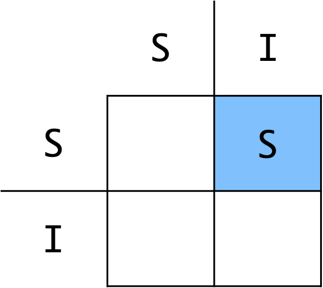

In the grid graphic, `S` and `I` on the left side represent possible **source signals** for a map; `S` and `I` on the top represent possible **destination signals** for the map; the blue box represents the map joining sources and destinations. Configuration of the map `use_inst` property is represented with an `S` or `I` on the blue box. In the example above a singleton source is mapped to an instanced destination with the map `use_inst` property set to `false`.

<table style="width:100%">
  <tbody>
    <tr>
      <th style="width:10%">Diagram</th>
      <th style="width:40%">Example</th>
      <th style="width:60%">Description</th>
    </tr>
    <tr>
      <td colspan=3 style="background:lightgray;">
      Singleton –––> Singleton
      </td>
    <tr/>
    <tr>
      <td style="background:white;padding:5px">
        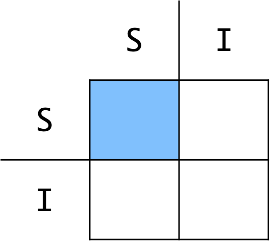
      </td>
      <td style="background:white;padding:5px">
        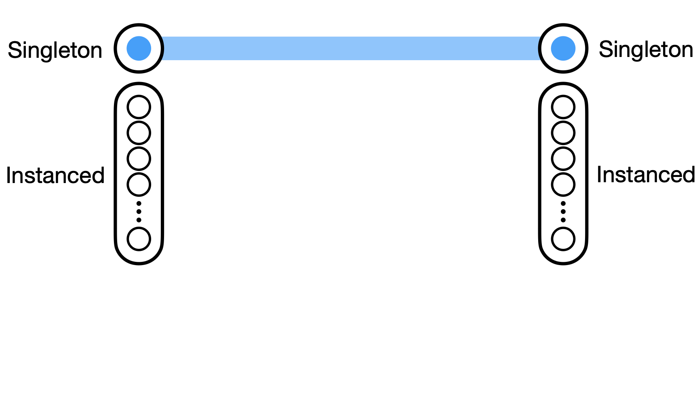
      </td>
      <td>The simplest configuration involves mapping one singleton signal to another singleton signal. In this case neither signal is multiplex nor ephemeral so it does not make any difference whether or not the map is configured to <code>use_inst</code>.</td>
    </tr>
    <tr>
      <td colspan=3 style="background:lightgray;">
      Singleton –––> Instanced
      </td>
    <tr/>
    <tr>
      <td style="background:white;padding:5px">
        
      </td>
      <td style="background:white;padding:5px">
        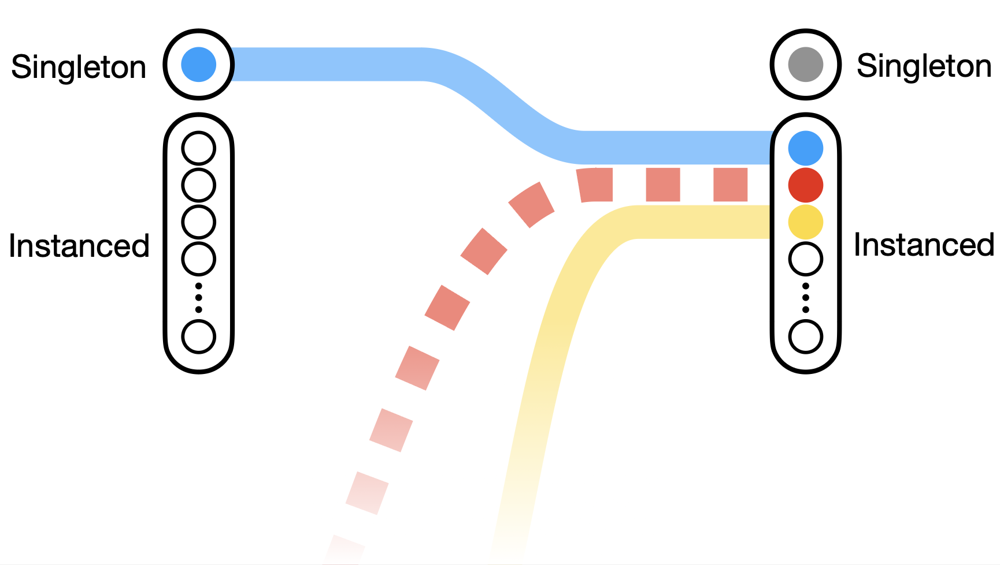
      </td>
      <td>When mapping a singleton signal to an instanced signal the map will default to <code>use_inst=1</code>. Updates to the source signal will activate and update a single instances of the destination signal. Other signals mapped to this destination will address different instances.</td>
    </tr>
    <tr>
      <td style="background:white;padding:5px">
        
      </td>
      <td style="background:white;padding:5px">
        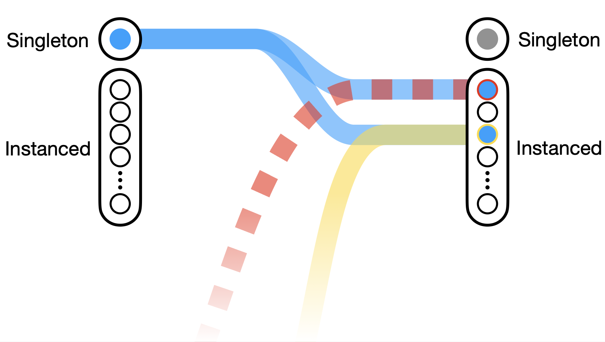
      </td>
      <td>If the map is set instead to <code>use_inst=0</code> updates to the source signal will propagate to all active instances of the destination. Notably, these updates will not cause activation of reserved instances.</td>
    </tr>
    <tr>
      <td colspan=3 style="background:lightgray;">
      Instanced –––> Singleton
      </td>
    <tr/>
    <tr>
      <td style="background:white;padding:5px">
        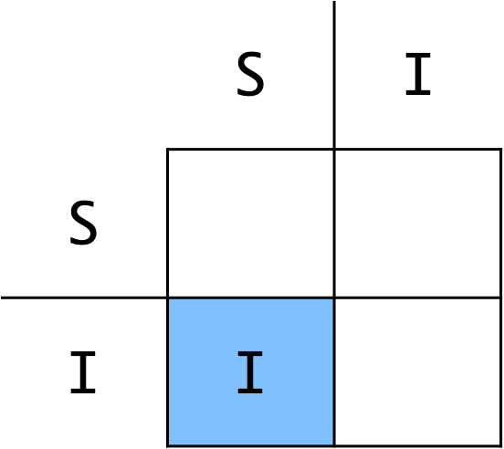
      </td>
      <td style="background:white;padding:5px">
        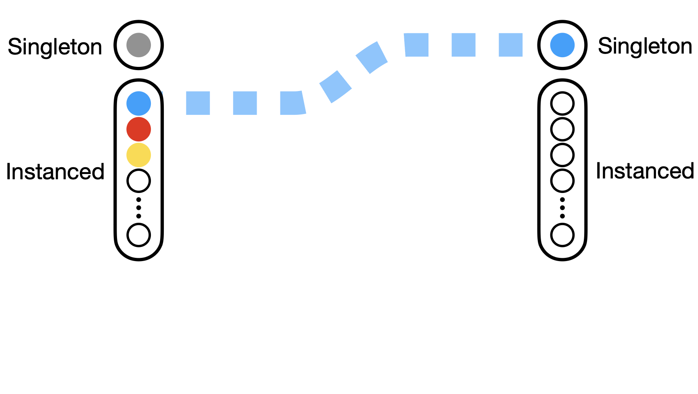
      </td>
      <td>When mapping an instanced signal to a singleton signal the map will default to <code>use_inst=1</code>. This means that a single instance (the first to be updated following creation of the map) will control the destination signal, and updates to other instances of the source will not propagate to the destination.</td>
    </tr>
    <tr>
      <td style="background:white;padding:5px">
        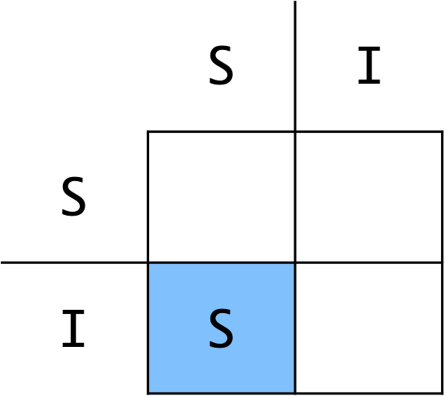
      </td>
      <td style="background:white;padding:5px">
        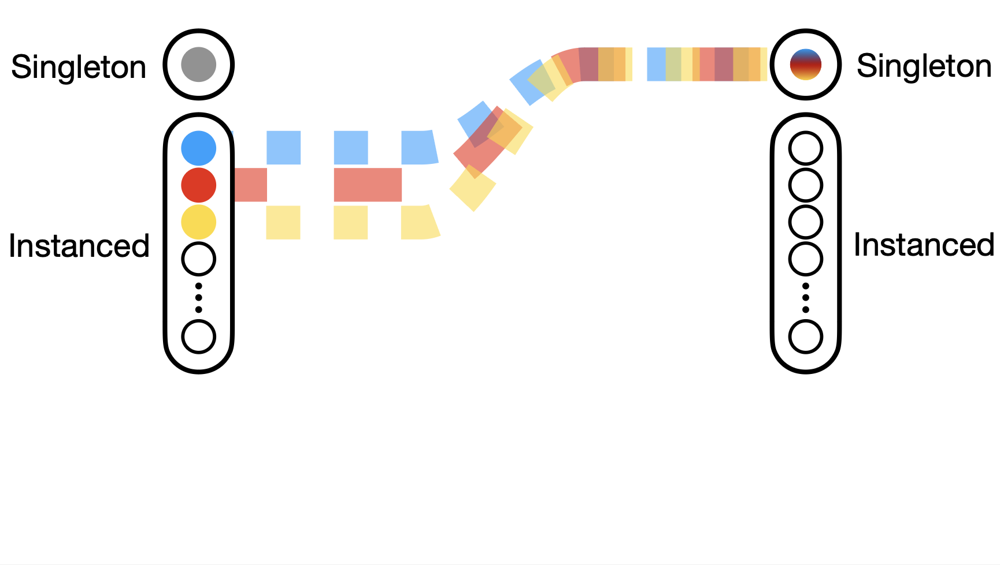
      </td>
      <td>If the map is set instead to <code>use_inst=0</code>, an update to any of the source instances will propagate to the destination signal, effectively multiplexing the source signal updates.</td>
    </tr>
    <tr>
      <td colspan=3 style="background:lightgray;">
      Instanced –––> Instanced
      </td>
    <tr/>
    <tr>
      <td style="background:white;padding:5px">
        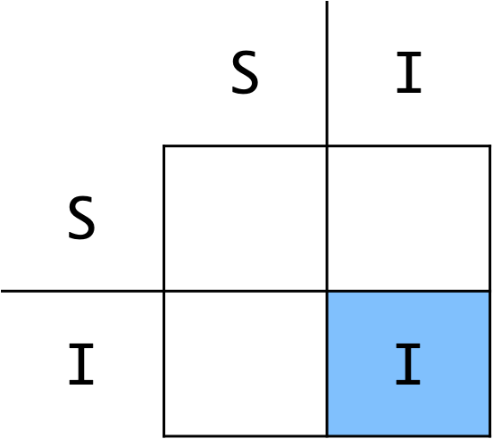
      </td>
      <td style="background:white;padding:5px">
        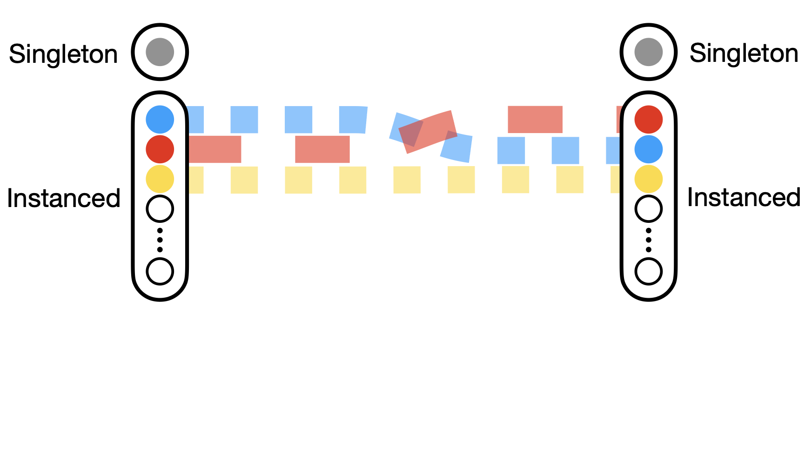
      </td>
      <td>When mapping an instanced signal to another instanced signal, the map will default to <code>use_inst=1</code>. Source instances will influence the value and lifetime of corresponding instances of the destination signal. Note that the source and destination signals do not need to have the same number of instances available; for more information read about <a href="">resource stealing</a>.</td>
    </tr>
    <tr>
      <td style="background:white;padding:5px">
        
      </td>
      <td style="background:white;padding:5px">
        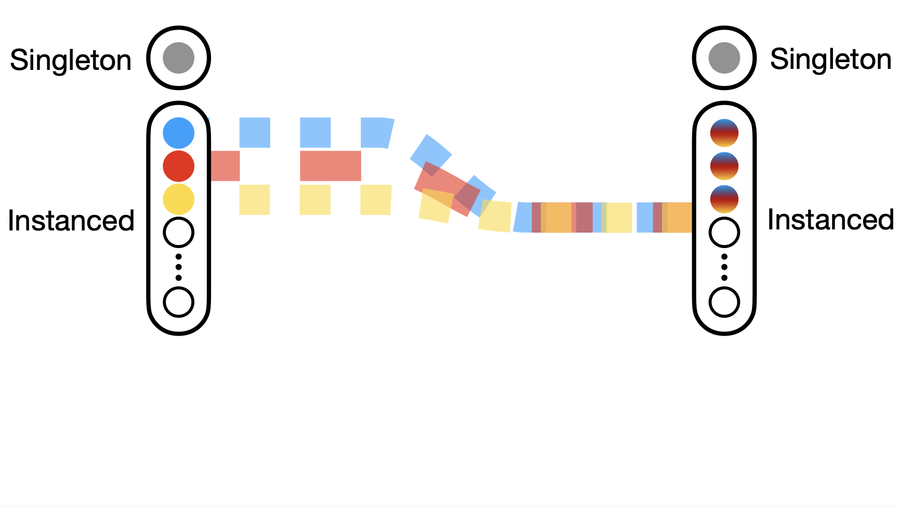
      </td>
      <td>If the map is set instead to <code>use_inst=0</code>, an update to any of the source instances will propagate to every active instance of the destination.</td>
    </tr>
    <tr>
      <td colspan=3 style="background:lightgray;">
      Convergent Mixed –––> Singleton*
       <small>*Note: In a convergent map, the map expression can be used to configure whether updates from each source will cause evaluation and destination update. In the descriptions below we will assume that all sources are configured to trigger updates.</small>
      </td>
    <tr/>
    <tr>
      <td style="background:white;padding:5px">
        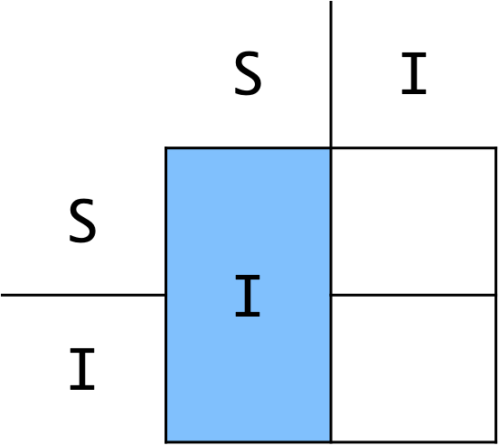
      </td>
      <td style="background:white;padding:5px">
        
      </td>
      <td>When creating a convergent (many-to-one) map, the <code>use_inst</code> property will default to <code>1</code> if any of the signals involved in the map are instanced. In the case of a convergent map with mixed instances/singleton sources and a singleton destination, this means that only one of the source instances will contribute to destination updates.</td>
    </tr>
    <tr>
      <td style="background:white;padding:5px">
        
      </td>
      <td style="background:white;padding:5px">
        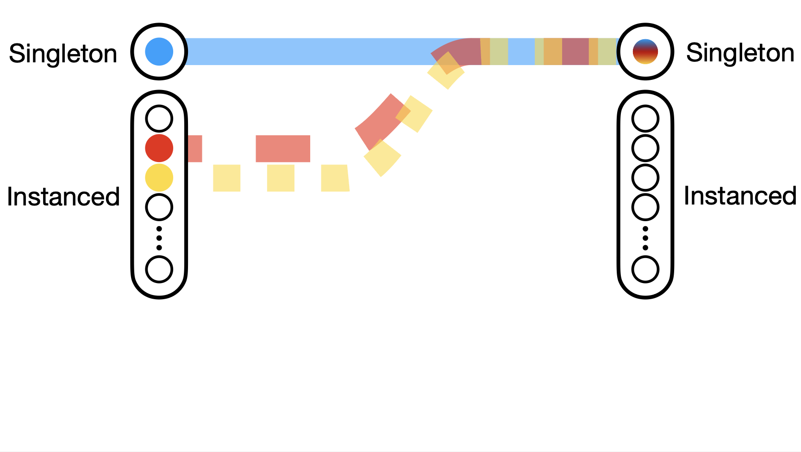
      </td>
      <td>If this map is set instead to <code>use_inst=0</code>, all active instances of the instanced source will contribute to destination updates.</td>
    </tr>
    <tr>
      <td colspan=3 style="background:lightgray;">
      Convergent Mixed –––> Instanced*
       <small>*Note: In a convergent map, the map expression can be used to  configure whether updates from each source will cause evaluation and destination update. In the descriptions below we will assume that all sources are configured to trigger updates.</small>
      </td>
    <tr/>
    <tr>
      <td style="background:white;padding:5px">
        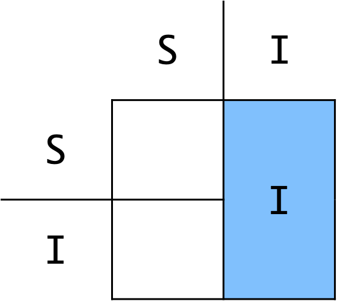
      </td>
      <td style="background:white;padding:5px">
        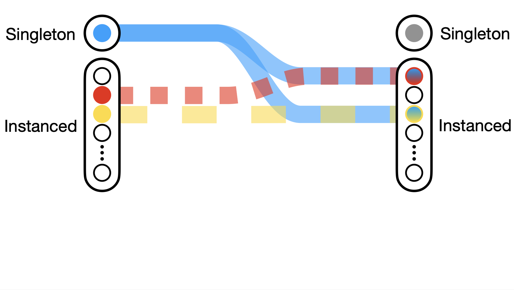
      </td>
      <td>When creating a convergent (many-to-one) map, the <code>use_inst</code> property will default to <code>1</code> if any of the signals involved in the map are instanced. In the case of a convergent map with mixed instances/singleton sources and an instanced destination, this means that each source instance will update a corresponding destination instance, and updates to the singleton source will update all active instances addressed through this map. TODO CHECK: only dst instances addressed through this map should be updated by singleton source updates!</td>
    </tr>
    <tr>
      <td style="background:white;padding:5px">
        
      </td>
      <td style="background:white;padding:5px">
        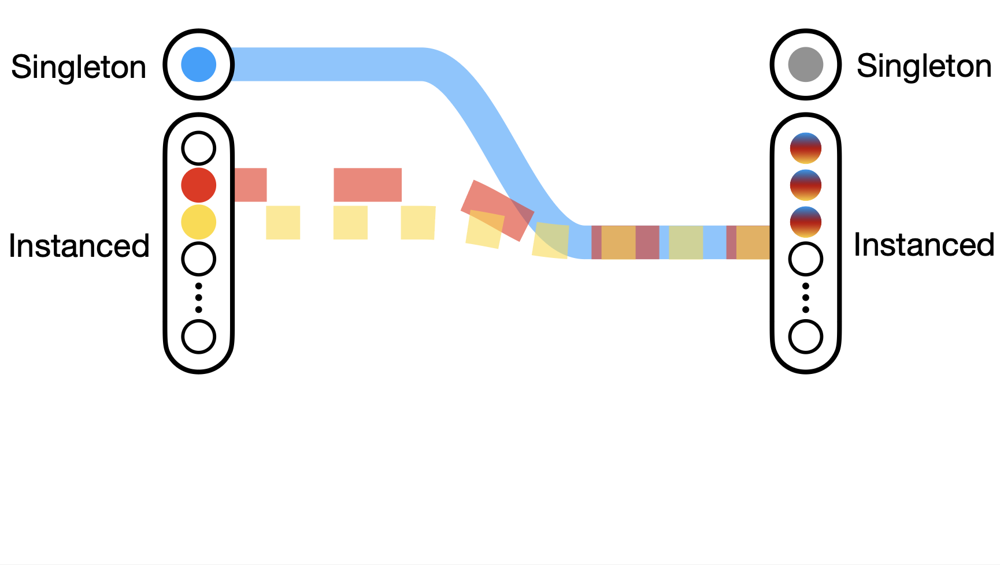
      </td>
      <td>If the map is set instead to use_inst=0, an update to the singleton source or any instance of the instanced source will propagate to every active instance of the destination.</td>
    </tr>
  </tbody>
</table>